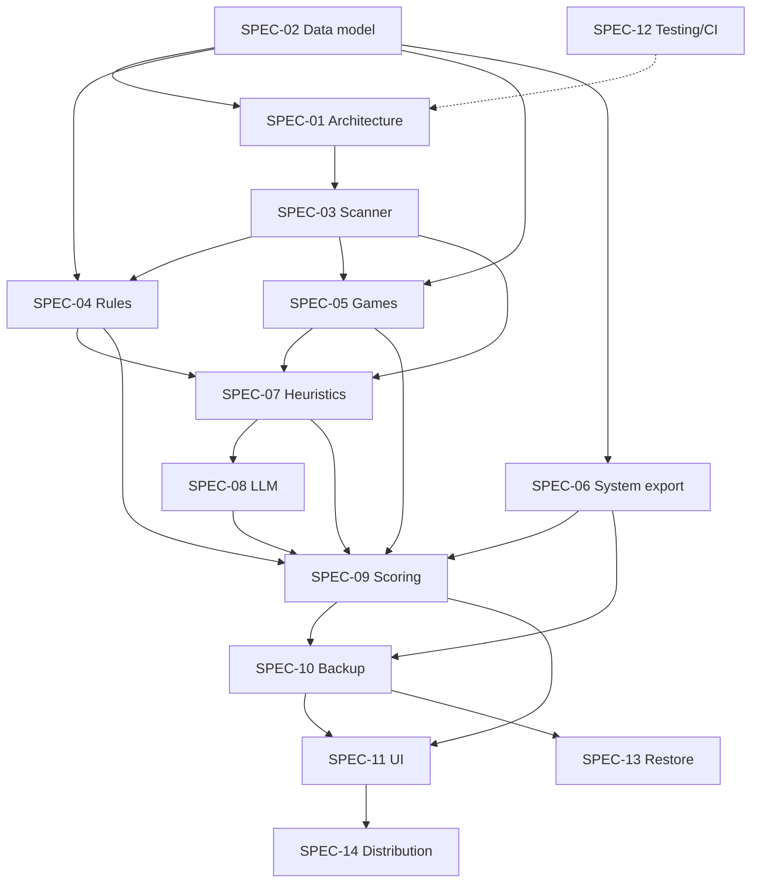

# SPEC-00: SaveKeeper — главная спецификация

| Поле | Значение |
|---|---|
| ID | SPEC-00 |
| Статус | approved |
| Роль | Оркестрирующая спека: видение, принципы, индекс спек, фазы, правила работы |
| Последнее изменение | 2026-10-01 (§3: MSRV 1.80 → 1.88; §8.1: нормативные/живые разделы, порядок утверждения; синхронизация индекса) |

> Это точка входа. Любая работа над проектом начинается с чтения этого файла,
> затем читается спека конкретной фичи (см. §5). Детали реализации сюда **не пишутся**:
> они живут в фичевых спеках. Здесь только то, что касается всего проекта.

---

## 1. Видение

**SaveKeeper** — портативная программа для Windows 10/11. Перед переустановкой системы
она находит всё, что нельзя восстановить простой переустановкой программ, и сохраняет
это в один переносимый бэкап:

- сохранения и настройки игр;
- настройки и данные программ (`AppData`, реестр);
- пользовательские файлы вне стандартных папок;
- окружение разработчика (ключи SSH, git-конфиги, репозитории с незапушенными изменениями, WSL);
- системные настройки (список программ для переустановки, профили Wi-Fi, драйверы и т.д.).

Главная ценность — **ответ на вопрос «что я забуду сохранить?»**. Программа не только
копирует файлы, но и объясняет, *почему* каждая находка важна, и отделяет незаменимое
от того, что можно скачать заново.

### 1.1 Целевой пользователь
- Геймер или «продвинутый пользователь», который переустанавливает Windows раз в 1–3 года.
- Разработчик с нестандартным окружением.
- Человек, который помогает с переустановкой знакомым (запускает программу с флешки).

### 1.2 Ключевой сценарий (MVP)
1. Пользователь запускает `savekeeper.exe` с флешки.
2. Нажимает «Сканировать». Выбирает диски и включает или выключает LLM-анализ.
3. Видит сгруппированный список находок: категория, приложение, размер, оценка важности, объяснение.
4. Корректирует выбор (по умолчанию уже отмечено рекомендуемое).
5. Выбирает, куда сохранить. Получает бэкап (zip или папку) с `manifest.json` и отчётом `report.html`.
6. *(После MVP, SPEC-13)* На новой системе запускает SaveKeeper → «Восстановить».

## 2. Принципы (обязательны для всех спек)

| # | Принцип | Следствие |
|---|---|---|
| P1 | **Только чтение источника** | Сканирование и бэкап никогда не изменяют, не перемещают и не удаляют исходные файлы. Любая запись идёт только в папку назначения и в data-директорию программы. |
| P2 | **Приватность по умолчанию** | Содержимое файлов никогда не покидает машину. В облачную LLM уходят только обезличенные метаданные (SPEC-08 §privacy). Облачная LLM выключена по умолчанию. |
| P3 | **Объяснимость** | У каждой находки есть хотя бы одно `Evidence` с человекочитаемой причиной. Никаких «чёрных ящиков». |
| P4 | **Детерминированное ядро, LLM как надстройка** | Программа полностью работает без LLM. LLM только классифицирует то, что не распознали правила и эвристики. |
| P5 | **Портативность** | Один exe без установки. Конфиг и данные лежат рядом с exe (SPEC-01 §4.8). Права администратора не нужны, кроме отдельных опциональных экспортов. |
| P6 | **Безопасность по умолчанию** | Чувствительные данные (пароли Wi-Fi, ключи, токены) явно помечаются, пользователь предупреждается. Возможно шифрование бэкапа (SPEC-10). |
| P7 | **Отказоустойчивость** | Ошибка доступа к одному файлу или папке не останавливает скан. Она попадает в отчёт как предупреждение. |
| P8 | **Отменяемость** | Любую долгую операцию (скан, LLM, бэкап) можно отменить, промежуточное состояние остаётся консистентным. |

## 3. Технологический стек

| Слой | Выбор | Примечание |
|---|---|---|
| Язык ядра | Rust (edition 2021, MSRV 1.88) | Cargo workspace, крейты `sk-*` (SPEC-01) |
| GUI | Tauri 2 + React 18 + TypeScript + Vite | WebView2 (есть в Win10/11) |
| Асинхронность | `tokio` | Параллельное сканирование: `rayon` / `jwalk` |
| Ошибки | `thiserror` в библиотеках, `anyhow` только в бинарниках | |
| Логи | `tracing` + `tracing-subscriber` (файл в data-dir) | |
| Сериализация | `serde`, `serde_json`, `serde_yaml` | |
| Windows API | `windows` crate (Known Folders, реестр), `winreg` | |
| Типы для фронта | `specta` + `tauri-specta` | Автогенерация TS-типов |
| LLM | Трейт `Classifier`. Провайдеры: Ollama, OpenAI-совместимый (llama.cpp / LM Studio), Anthropic | SPEC-08 |
| Целевая ОС | Windows 10 22H2+, Windows 11, x86_64 (ARM64 — желательно) | |
| Лицензия | MIT, бесплатно и некоммерчески | Встроенный манифест Ludusavi под CC BY-NC-SA (SPEC-05 FR-05-11) |
| Среда разработки | Windows (основная) | Кроссплатформенные крейты тестируются и на Linux/macOS в CI |

## 4. Глоссарий

| Термин | Значение |
|---|---|
| **Находка (Finding)** | Единица, которую можно сохранить: набор файлов, ветка реестра или системный экспорт (SPEC-02). |
| **Коллектор (Collector)** | Компонент, который порождает находки: правила, игры, система, эвристики (SPEC-01 §4). |
| **Evidence** | Причина, по которой находка существует или так оценена, с указанием источника и уверенности. |
| **Шаблон пути (PathTemplate)** | Путь с токенами вида `{APPDATA}\Foo`, независимый от имени пользователя и буквы диска (SPEC-02 §3). |
| **FolderSummary** | Компактное описание папки (расширения, размеры, даты, примеры имён) для эвристик и LLM. |
| **Reinstallable** | Данные, которые восстанавливаются переустановкой или скачиванием (бинарники, кэш). По умолчанию не сохраняются. |
| **Скан (Scan)** | Полный прогон конвейера обнаружения → результат `ScanReport`. |
| **Бэкап (Backup)** | Архив или папка с выбранными находками + `manifest.json` + `report.html`. |

## 5. Индекс спецификаций

Каждая спека самодостаточна в своей области и ссылается на остальные по ID.

| ID | Файл | Область | Фаза | Крейт(ы) | Статус |
|---|---|---|---|---|---|
| SPEC-00 | [00-master.md](00-master.md) | Эта спека | — | — | approved |
| SPEC-01 | [01-architecture.md](01-architecture.md) | Архитектура, крейты, конвейер, конфиг, data-dir | P0 | все | in-progress |
| SPEC-02 | [02-data-model.md](02-data-model.md) | Доменные типы, шаблоны путей, форматы | P0 | `sk-core` | approved |
| SPEC-03 | [03-scanner.md](03-scanner.md) | Обход ФС, замер размеров, FolderSummary, исключения | P1 | `sk-scan` | approved |
| SPEC-04 | [04-rules-engine.md](04-rules-engine.md) | Правила известных мест (YAML) + встроенная база | P1 | `sk-rules` | approved |
| SPEC-05 | [05-games.md](05-games.md) | Сохранения игр: манифест Ludusavi, лаунчеры | P1 | `sk-games` | approved |
| SPEC-06 | [06-system-export.md](06-system-export.md) | winget, реестр, Wi-Fi, драйверы, прочие системные экспорты | P1 | `sk-system` | approved |
| SPEC-07 | [07-heuristics.md](07-heuristics.md) | Неизвестные папки, git-репозитории, пользовательские файлы, отсев мусора | P2 | `sk-heuristics` | approved |
| SPEC-08 | [08-llm-classifier.md](08-llm-classifier.md) | Абстракция LLM, провайдеры, промпт, приватность, кэш | P2 | `sk-llm` | approved |
| SPEC-09 | [09-scoring.md](09-scoring.md) | Оценка важности, выбор по умолчанию, слияние находок | P2 | `sk-score` | approved |
| SPEC-10 | [10-backup.md](10-backup.md) | Запись бэкапа, манифест, отчёт, шифрование, верификация | P3 | `sk-backup` | approved |
| SPEC-11 | [11-ui.md](11-ui.md) | Tauri-приложение: экраны, IPC, состояние, i18n | P3 | `app/` | approved |
| SPEC-12 | [12-testing-ci.md](12-testing-ci.md) | Стратегия тестов, фикстуры, CI | P0 (сквозная) | все | in-progress |
| SPEC-13 | [13-restore.md](13-restore.md) | Восстановление из бэкапа | P4 (post-MVP) | `sk-restore` | approved |
| SPEC-14 | [14-distribution.md](14-distribution.md) | Портативная сборка, версии, релизы, повышение прав | P3 | `app/`, CI | approved |

### 5.1 Граф зависимостей

## 6. Фазы и вехи

Фаза считается закрытой, когда выполнены все задачи её спек и критерии приёмки фазы.

### P0 — Фундамент
**Спеки:** SPEC-01, SPEC-02, SPEC-12 (базовая часть)
**Результат:** workspace собирается, есть `sk-core` с типами, `sk-cli` с командой `scan --dry-run`, CI зелёный на Windows и Linux.
**Критерии:**
- [ ] `cargo build --workspace` и `cargo test --workspace` проходят на Windows.
- [ ] Типы SPEC-02 реализованы, сериализация покрыта round-trip тестами.
- [ ] Разрешение шаблонов путей через Known Folders работает (включая перенаправление Documents в OneDrive).

### P1 — Обнаружение (детерминированное)
**Спеки:** SPEC-03, SPEC-04, SPEC-05, SPEC-06
**Результат:** `sk-cli scan` выводит JSON-отчёт с находками из правил, игр и системных экспортов, с размерами.
**Критерии:**
- [ ] На эталонной машине разработчика находится ≥ 90% вручную составленного списка «важного».
- [ ] Полный скан профиля пользователя (без LLM) на SSD ≤ 60 с для 1 млн файлов.

### P2 — Интеллект
**Спеки:** SPEC-07, SPEC-08, SPEC-09
**Результат:** неизвестные папки классифицируются эвристиками и LLM, у всех находок есть оценка и выбор по умолчанию.
**Критерии:**
- [ ] Каждая top-level папка `AppData\{Roaming,Local,LocalLow}` либо покрыта правилом, либо классифицирована.
- [ ] Работает без LLM: при выключенной LLM находки остаются с категорией `Unknown` и понятным объяснением.
- [ ] Кэш LLM: повторный скан не делает повторных запросов для неизменившихся папок.

### P3 — Бэкап и GUI → **MVP-релиз v0.1.0**
**Спеки:** SPEC-10, SPEC-11, SPEC-14
**Результат:** портативный `savekeeper.exe` с полным сценарием §1.2 (шаги 1–5).
**Критерии:**
- [ ] Бэкап верифицируется: хэши всех файлов в `manifest.json` совпадают с архивом.
- [ ] Отмена на любом этапе не оставляет «битого» архива без пометки.
- [ ] Exe запускается на чистой Windows 10 22H2 и Windows 11 без установки чего-либо.

### P4 — Post-MVP
**Спеки:** SPEC-13 + будущие (см. §9)
**Результат:** восстановление, расширения.

## 7. Сквозные соглашения

### 7.1 Код
- Имена крейтов: `sk-<область>`. Публичный API каждого крейта описан в его спеке (§4.1). Изменение API означает изменение спеки.
- `#![deny(unsafe_code)]` везде, кроме `sk-core::win` и `sk-scan::win` (FFI), где каждый `unsafe`-блок сопровождается комментарием `// SAFETY:`.
- Windows-специфичный код изолируется в модулях `win` под `#[cfg(windows)]` с заглушками для других ОС, чтобы логику можно было тестировать кроссплатформенно.
- Файлы ≤ 500 строк. `cargo fmt`, `cargo clippy -D warnings` обязательны.
- Нет `unwrap()`/`expect()` в библиотечном коде, кроме доказуемо невозможных случаев с комментарием.
- Все пути внутри программы хранятся как `PathBuf`, наружу (JSON, UI) выводятся как строки UTF-8 (с lossy-заменой и флагом, SPEC-02 §5).

### 7.2 Язык
- Спеки на русском. Код, идентификаторы, комментарии, коммиты и логи на английском.
- Тексты UI через i18n (ru, en) (SPEC-11).

### 7.3 Идентификаторы в спеках
- Требования: `FR-<спека>-<NN>`, `NFR-<спека>-<NN>` (например `FR-04-03`).
- Задачи: `T-<спека>-<NN>` (например `T-05-07`).
- Ссылки на раздел: `SPEC-02 §3.1`.

## 8. Процесс работы по спекам (spec-driven)

### 8.1 Жизненный цикл спеки
`draft` → (ревью) → `approved` → (начата первая задача) → `in-progress` → (все задачи и критерии выполнены) → `done`.

- Код по спеке пишется только когда она в статусе `approved` или выше.
- Если при реализации выясняется, что спека неверна, **сначала правится спека** (с пометкой в «Последнее изменение»), затем код.
- Изменения публичного API, форматов файлов и схем (SPEC-02, манифест бэкапа) требуют правки всех зависимых спек (см. «Используется в»).
- **Источник истины для статуса** — поле «Статус» в шапке спеки. Колонка «Статус» в индексе §5 его зеркалит и обновляется в том же коммите, что и шапка.

#### 8.1.1 Нормативные и живые разделы SPEC-00

SPEC-00 утверждается, как и остальные спеки, но часть её содержимого меняется постоянно. Поэтому разделы делятся на два типа:

| Тип | Разделы | Как меняются |
|---|---|---|
| **Нормативные** | §1 Видение, §2 Принципы, §3 Стек, §6 Фазы и критерии, §7 Соглашения, §8 Процесс | Только через явное ревью. После изменения все зависимые спеки проверяются на соответствие, а несоответствия правятся в том же PR или заводятся задачами. |
| **Живые** | §4 Глоссарий (добавление терминов), §5 Индекс и граф, §9 Бэклог, §10 Риски | Обновляются без повторного ревью, если не противоречат нормативным разделам. Например: смена статуса спеки, новая идея в бэклоге, новый риск. |

Изменение в живом разделе, которое по сути меняет норму (например, перенос спеки в другую фазу через индекс), считается нормативным.

#### 8.1.2 Порядок утверждения

Спека утверждается не раньше, чем утверждены все спеки из её «Зависит от». Это гарантирует, что код не пишется поверх неутверждённых контрактов.

1. **SPEC-00** — фундамент для всех.
2. **SPEC-02** — общие типы. SPEC-01 на них опирается.
3. **SPEC-01** — архитектура.
4. **SPEC-12** — тестовая инфраструктура и CI фазы P0.
5. Дальше по фазам (§6), внутри фазы — по графу §5.1: P1 (03 → 04, 05, 06) → P2 (07 → 08 → 09) → P3 (10 → 11 → 14) → P4 (13).

### 8.2 Как брать задачу (для человека или агента)
1. Прочитать SPEC-00 → нужную спеку целиком → спеки из её «Зависит от» (минимум §4.1).
2. Взять первую невыполненную задачу `T-..`, у которой выполнены все зависимости.
3. Реализовать + тесты из §6 спеки.
4. Отметить `[x]` у задачи. Если это последняя задача, проверить §8 «Критерии приёмки» и сменить статус.
5. Коммит: `feat(sk-rules): T-04-03 rule matcher` (ID задачи в сообщении).

### 8.3 Definition of Done (для любой задачи)
- [ ] Код соответствует §4 спеки. Отклонения внесены в спеку.
- [ ] Тесты написаны и проходят (`cargo test -p <crate>`), на Windows для `cfg(windows)`-кода.
- [ ] `cargo clippy -D warnings`, `cargo fmt --check` проходят.
- [ ] Публичные элементы задокументированы (`///`).
- [ ] Нет регрессий в `cargo test --workspace`.

## 9. Бэклог будущих спек (не в MVP)

| Идея | Предполагаемая спека |
|---|---|
| Копирование заблокированных файлов через VSS (Volume Shadow Copy) | SPEC-15 |
| Сверка с NSRL (исключение известных файлов софта по хэшу) | SPEC-16 |
| Быстрый скан через NTFS MFT / USN Journal | SPEC-17 |
| Интеграция с Everything SDK | SPEC-17 |
| Экспорт WSL-дистрибутивов и томов Docker | SPEC-18 |
| Инкрементальные бэкапы и сравнение двух сканов | SPEC-19 |
| Агентный режим LLM (модель сама исследует папку через инструменты) | расширение SPEC-08 |
| Обучение на решениях пользователя (эмбеддинги путей) | расширение SPEC-09 |
| Сообщество: публикация пользовательских правил | расширение SPEC-04 |

## 10. Риски

| Риск | Митигация |
|---|---|
| Ложноотрицательные находки (что-то важное пропущено) | Эвристики + LLM + явный раздел «Не распознано» в UI и отчёте. Лучше лишнее, чем пропущенное. |
| Огромные папки (кэши, игры) раздувают бэкап | Категория `Reinstallable`/`Cache` не выбирается по умолчанию. Предупреждение о размере. Лимиты в SPEC-09. |
| Заблокированные файлы (запущена игра или браузер) | Детект процессов, предупреждение, повтор. VSS — в SPEC-15. |
| Утечка приватных данных в облачную LLM | Облако выключено по умолчанию, обезличивание, превью отправляемых данных (SPEC-08). |
| Изменение формата манифеста Ludusavi | Версионирование, кэш последней рабочей версии, встроенный снапшот (SPEC-05). |
| Длинные пути > 260 символов | Везде используем `\\?\`-префикс или longPathAware-манифест (SPEC-03, SPEC-14). |
