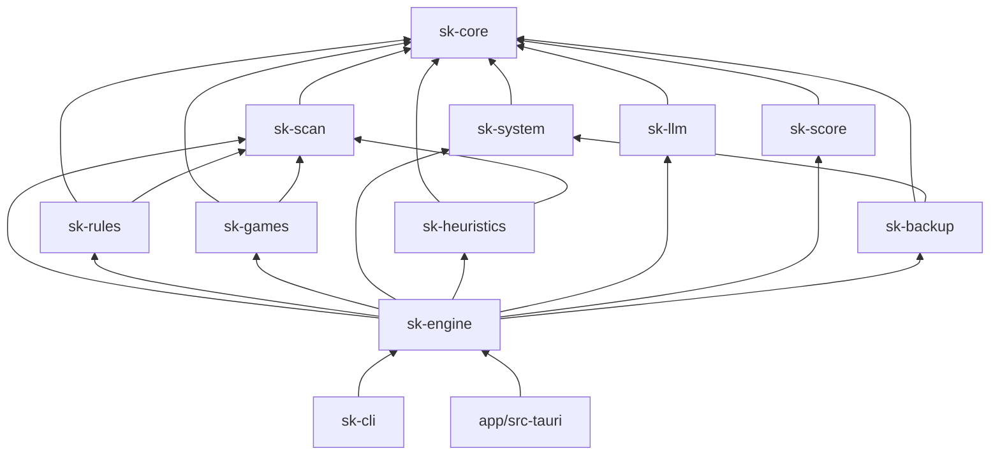
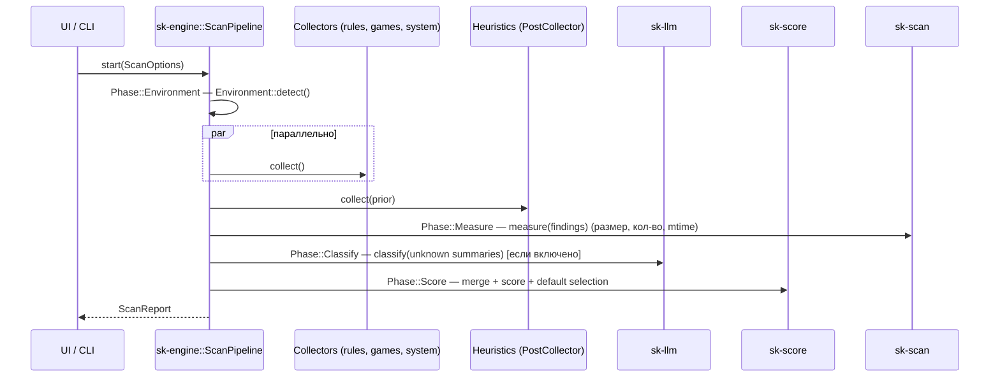

# SPEC-01: Архитектура

| Поле | Значение |
|---|---|
| ID | SPEC-01 |
| Статус | in-progress |
| Фаза | P0 |
| Крейт(ы) | все, в первую очередь `sk-core`, `sk-engine`, `sk-cli` |
| Зависит от | SPEC-00, SPEC-02 |
| Используется в | все спеки |
| Последнее изменение | 2026-10-02 (§4.4: внедрение зависимостей `ScanPipeline`, поведение `run` по фазам, сохранение отчётов, заглушка сканера; §4.7: варианты `EngineError`; §4.8.3: API `sk-core::logging`, обезличивание в писателе, имя файла лога; §4.8.2: API `Config`/`LoadedConfig`/`ConfigWarning`/`DataDir`, правила загрузки, типы значений; §4.5: `ScanPhase`, `LogLevel`, API и правила `ThrottledSink`; T-01-03: `PathSet` вынесен в T-02-02; MSRV 1.93; YAML: `serde-saphyr`; `FsScanner` и секции конфига в `sk-core`; правила графа для `sk-testkit`/`xtask` и транзитивных рёбер; зависимости T-01-03/T-01-04; уточнение T-01-01) |

## 1. Цель

Задать структуру репозитория, границы крейтов, конвейер скана (pipeline), модель
выполнения (async, прогресс, отмена), конфигурацию и расположение данных. Это «скелет»,
в который встраиваются все фичевые спеки.

## 2. Область

### 2.1 Входит
- Структура репозитория и Cargo workspace.
- Ответственность и зависимости каждого крейта.
- Трейт `Collector` и конвейер `ScanPipeline`.
- События прогресса и отмена.
- Конфиг `savekeeper.config.json` и data-dir.
- Логирование.
- CLI `sk-cli` (для разработки и отладки).

### 2.2 Не входит
- Доменные типы: SPEC-02.
- Логика конкретных коллекторов: SPEC-04..07.
- GUI: SPEC-11.

## 3. Требования

### 3.1 Функциональные
- **FR-01-01** — Ядро (всё, кроме `app/`) не зависит от Tauri и может работать из CLI.
- **FR-01-02** — Коллекторы выполняются параллельно и независимо. Падение одного не ломает скан, а превращается в `ScanIssue`.
- **FR-01-03** — Каждая фаза конвейера отправляет события прогресса через единый канал.
- **FR-01-04** — Любую операцию можно отменить через `CancellationToken`. Коллекторы проверяют токен не реже чем раз в 100 мс работы.
- **FR-01-05** — Конфиг ищется рядом с exe (портативный режим). Если папка exe недоступна для записи, используется `%LOCALAPPDATA%\SaveKeeper\` с предупреждением.
- **FR-01-06** — CLI поддерживает команды `scan`, `backup`, `rules validate`, `manifest update`, `config show`.

### 3.2 Нефункциональные
- **NFR-01-01** — Холодный старт GUI до интерактивного окна ≤ 2 с.
- **NFR-01-02** — Потребление памяти при скане 1 млн файлов ≤ 500 МБ (находки и сводки, а не все файлы в памяти).
- **NFR-01-03** — Сетевые запросы делают только `sk-llm`, `sk-games` (загрузка манифеста) и `app/` (опциональная проверка обновлений, SPEC-14 FR-14-07, выключена по умолчанию).

## 4. Дизайн

### 4.1 Структура репозитория

```
savekeeper/
├── Cargo.toml                 # [workspace]
├── rust-toolchain.toml        # stable, MSRV 1.93
├── deny.toml                  # cargo-deny: лицензии, advisories
├── crates/
│   ├── sk-core/               # SPEC-02: доменные типы, PathTemplate, KnownFolders, конфиг, события, ошибки, трейт FsScanner
│   ├── sk-scan/               # SPEC-03: обход ФС, замер, FolderSummary, исключения
│   ├── sk-rules/              # SPEC-04: движок правил + встроенные правила
│   ├── sk-games/              # SPEC-05: Ludusavi-манифест, лаунчеры
│   ├── sk-system/             # SPEC-06: системные экспорты
│   ├── sk-heuristics/         # SPEC-07: эвристики
│   ├── sk-llm/                # SPEC-08: классификатор
│   ├── sk-score/              # SPEC-09: оценка, слияние, выбор по умолчанию
│   ├── sk-backup/             # SPEC-10: запись бэкапа
│   ├── sk-restore/            # SPEC-13 (P4)
│   ├── sk-engine/             # этот документ §4.4: оркестрация конвейера
│   ├── sk-cli/                # бинарник для разработки
│   └── sk-testkit/            # SPEC-12: FakeProfile, фикстуры, хелперы контекста и событий (только dev-dependency)
├── xtask/                     # SPEC-12: генерация фикстур, проверка графа крейтов, экспорт bindings.ts
├── rules/                     # SPEC-04: YAML-правила (встраиваются в бинарник через include_dir!)
├── app/                       # SPEC-11: Tauri 2
│   ├── src-tauri/             # Rust-часть: команды, зависит от sk-engine
│   └── src/                   # React + TS
├── fixtures/                  # SPEC-12: тестовые деревья ФС, манифесты
├── specs/                     # спецификации
└── .github/workflows/         # SPEC-12, SPEC-14
```

### 4.2 Крейты и зависимости



Правила (проверяются в CI скриптом `xtask check-deps`, SPEC-12):
- **Крейты уровня фич не зависят друг от друга**, кроме явно указанных: `sk-scan` как утилита, `sk-backup → sk-system` для выполнения экспортов. Всё связывает `sk-engine`.
- `sk-restore` (P4) зависит от `sk-core`, `sk-system`, `sk-backup` (формат манифеста).
- `sk-testkit` зависит от `sk-core` и `sk-scan` и подключается **только** как `[dev-dependencies]`.
- `xtask` не входит в релиз: может зависеть от любых крейтов workspace, но от него не зависит никто.
- Допустимо ребро `A → B`, если `B` достижим из `A` по графу выше (транзитивное замыкание). Например, `sk-cli → sk-core` разрешено, а `sk-rules → sk-games` — нет.
- Интерфейсы и типы, которые нужны в `sk-core` (`CollectContext`, `Config`), определяются в `sk-core`, реализации — в фичевых крейтах. Так `FsScanner` (SPEC-03 §4.1) объявлен в `sk-core::fs`, а реализован в `sk-scan`; секции конфига — в `sk-core::config` (§4.8.2).
- Механизм повышения прав (`ElevationBroker`, `ElevatedTask`) живёт в `sk-core::win::elevation` (SPEC-14 §4), чтобы `sk-backup`/`sk-restore` не зависели от `app/`.

| Крейт | Ответственность | Ключевые внешние зависимости |
|---|---|---|
| `sk-core` | Типы SPEC-02, `PathTemplate`, `KnownFolders`, `Config` со всеми секциями, `Event`, `CancellationToken` (реэкспорт `tokio_util::sync`), трейт `FsScanner` и его типы (SPEC-03 §4.1), общие ошибки | `serde`, `thiserror`, `windows`, `uuid`, `time`, `blake3`, `globset` |
| `sk-scan` | Параллельный обход, `measure()`, `summarize()`, глобальные исключения | `jwalk`, `globset`, `rayon` |
| `sk-rules` | Загрузка, валидация и матчинг YAML-правил | `serde-saphyr`, `globset`, `include_dir` |
| `sk-games` | Парсинг манифеста Ludusavi, детект лаунчеров, резолв путей игр | `serde-saphyr` (большой манифест: feature `huge_documents` или увеличенный бюджет парсера), `reqwest` (blocking=false), `keyvalues-parser` (VDF) |
| `sk-system` | Обнаружение и выполнение системных экспортов | `winreg`, `std::process` |
| `sk-heuristics` | Неизвестные папки, git, пользовательские файлы, мусор | `gix` (git) |
| `sk-llm` | Трейт `Classifier`, провайдеры, промпт, кэш (JSONL) | `reqwest`, `serde_json`, `keyring`, `secrecy`; dev: `wiremock` |
| `sk-score` | Слияние находок, скоринг, выбор по умолчанию | — |
| `sk-backup` | Архив/папка, манифест, отчёт, шифрование, верификация | `zip`, `blake3`, `age` (шифрование) |
| `sk-engine` | `ScanPipeline`, `BackupJob`, прогресс, отмена, сборка `ScanReport` | `tokio` |
| `sk-cli` | CLI | `clap`, `anyhow`, `indicatif` |
| `sk-restore` | Восстановление (P4, SPEC-13) | `winreg` |
| `sk-testkit` | Тестовая инфраструктура (SPEC-12): `FakeProfile`, хелперы. Фейки живут рядом с трейтами: `MemFs` в `sk-scan`, `MockClassifier` в `sk-llm` | `tempfile`, `insta` |

### 4.3 Трейт Collector

```rust
// sk-core::collector
use async_trait::async_trait;

pub struct CollectContext {
    pub env: Arc<Environment>,          // SPEC-02 §3: известные папки, пользователь, диски
    pub config: Arc<Config>,            // §4.8
    pub scanner: Arc<dyn FsScanner>,    // трейт в sk-core::fs, реализации RealFs/MemFs в sk-scan (SPEC-03 §4.1)
    pub events: EventSink,              // §4.5
    pub cancel: CancellationToken,
}

#[async_trait]
pub trait Collector: Send + Sync {
    /// Стабильный идентификатор: "rules", "games", "system", "heuristics".
    fn id(&self) -> &'static str;

    /// Человекочитаемое имя для UI (ключ i18n).
    fn display_key(&self) -> &'static str;

    /// Порождает находки. Ошибки отдельных элементов кладутся в `CollectOutput::issues`,
    /// `Err` возвращается только если коллектор не может работать вообще.
    async fn collect(&self, ctx: &CollectContext) -> Result<CollectOutput, CollectorError>;
}

pub struct CollectOutput {
    pub findings: Vec<Finding>,         // SPEC-02 §2
    pub claimed_paths: Vec<PathBuf>,    // пути, которые коллектор «объяснил» (для SPEC-07: что считать неизвестным)
    pub issues: Vec<ScanIssue>,
}
```

Эвристики (SPEC-07) работают **после** остальных коллекторов, потому что им нужен
`claimed_paths`. Поэтому у них отдельный трейт `PostCollector`:

```rust
#[async_trait]
pub trait PostCollector: Send + Sync {
    fn id(&self) -> &'static str;
    async fn collect(&self, ctx: &CollectContext, prior: &PriorResults) -> Result<CollectOutput, CollectorError>;
}

pub struct PriorResults<'a> {
    pub findings: &'a [Finding],
    pub claimed: &'a PathSet,           // префиксное дерево путей, O(depth) проверка покрытия
}
```

### 4.4 Конвейер скана



| # | Фаза (`ScanPhase`) | Что происходит | Спека |
|---|---|---|---|
| 1 | `Environment` | Known Folders, пользователь, диски, версия Windows, лаунчеры | SPEC-02 §3, SPEC-05 §4 |
| 2 | `Collect` | `rules`, `games`, `system` параллельно (`tokio::join_all` + `spawn_blocking` для ФС) | SPEC-04/05/06 |
| 3 | `Heuristics` | Поиск неизвестного с учётом `claimed_paths` | SPEC-07 |
| 4 | `Measure` | Размеры, число файлов, последний mtime для каждой FileSet-находки | SPEC-03 §4 |
| 5 | `Classify` | LLM для находок `category = Unknown` (если включено) | SPEC-08 |
| 6 | `Score` | Слияние дублей и вложенности, скоринг, `default_selected` | SPEC-09 |
| 7 | `Done` | Сборка `ScanReport`, сохранение в data-dir (`scans/<scan_id>.json`) | SPEC-02 §6 |

```rust
// sk-engine
pub struct ScanOptions {
    pub roots: Vec<PathBuf>,            // доп. корни для эвристик (диски D:\, E:\ ...). По умолчанию: профиль + системный диск вне Windows/Program Files
    pub collectors: CollectorToggles,   // вкл/выкл каждый коллектор (SPEC-02 §6)
    pub llm: LlmMode,                   // Off | Local | Cloud (SPEC-02 §6, SPEC-08)
    pub max_depth: Option<u32>,
}

pub struct ScanPipeline { /* collectors, post_collectors, classifier, scorer */ }

impl ScanPipeline {
    pub fn new(config: Arc<Config>) -> Self;          // регистрирует коллекторы из конфигурации
    // Подмена зависимостей (тесты, CLI-отладка):
    pub fn with_collector(self, c: Arc<dyn Collector>) -> Self;
    pub fn with_post_collector(self, c: Arc<dyn PostCollector>) -> Self;
    pub fn with_scanner(self, s: Arc<dyn FsScanner>) -> Self;
    pub fn with_environment(self, env: Environment) -> Self;   // вместо Environment::detect()
    pub fn with_scans_dir(self, dir: PathBuf) -> Self;          // куда сохранять отчёты (DataDir::scans)
    pub fn with_app_version(self, v: String) -> Self;           // по умолчанию версия sk-engine
    pub async fn run(&self, opts: ScanOptions, events: EventSink, cancel: CancellationToken)
        -> Result<ScanReport, EngineError>;
    /// Оценка одной папки, добавленной пользователем вручную в UI (SPEC-11):
    /// rules → heuristics → measure → (LLM, если включено) → score. Возвращает Finding с EvidenceSource::User.
    pub async fn evaluate_single(&self, path: PathBuf, env: &Environment, cancel: CancellationToken)
        -> Result<Finding, EngineError>;
}

pub struct BackupJob;  // SPEC-10 §4.1: run(report, selection, target, events, cancel)
```

Поведение `run`:
- Каждая фаза шлёт `PhaseStarted`/`PhaseFinished`. Между фазами и во время `Collect` проверяется `cancel`: отмена прерывает задачи коллекторов и возвращает `EngineError::Cancelled` без сохранения отчёта.
- `Collect`: каждый включённый коллектор — отдельная задача `tokio::spawn`. `CollectorToggles` фильтрует по `id` (`rules`, `games`, `system`, `heuristics`), коллекторы с другими `id` работают всегда. `Err` коллектора → `ScanIssue { severity: Error, source: id, message_key: "collector.failed", args: { error } }`, паника → то же с `"collector.panicked"`. Каждый issue дублируется событием `Event::Issue`, находки — `Event::FindingsAdded`.
- `Heuristics`: post-коллекторы по очереди, `PriorResults.claimed` — `PathSet` из `claimed_paths` всех коллекторов и предыдущих post-коллекторов.
- `Measure`, `Classify`, `Score` в P0 только шлют события фазы; работу добавляют SPEC-03 (T-03-07), SPEC-08 и SPEC-09 (в том числе `Totals`). До этого `totals` = `Totals::default()`.
- `Done`: находки сортируются по порядку `Category`, затем по `score` по убыванию; отчёт сохраняется в `<scans_dir>/<scan_id>.json` (если задан), в каталоге остаются 10 самых новых отчётов по `finished_at`.
- Сканер по умолчанию до SPEC-03 T-03-04 — заглушка, которая на любой вызов возвращает `FsError::Io` («сканер ещё не реализован»); T-03-04 заменяет её на `RealFs`.
- `evaluate_single` реализуется вместе с SPEC-04/07 (нужны `rules` и `heuristics`), в T-01-06 не входит.

### 4.5 События и прогресс

```rust
// sk-core::events
#[derive(Serialize, specta::Type, Clone)]
#[serde(tag = "type", rename_all = "snake_case")]
pub enum Event {
    PhaseStarted  { phase: ScanPhase },
    PhaseFinished { phase: ScanPhase, elapsed_ms: u64 },
    Progress      { phase: ScanPhase, done: u64, total: Option<u64>, current: Option<String> },
    FindingsAdded { count: u32 },              // батчем, не по одной
    Issue         { issue: ScanIssue },
    BackupProgress{ bytes_done: u64, bytes_total: u64, files_done: u64, files_total: u64, current: Option<String> },
    Log           { level: LogLevel, message: String },
}

pub type EventSink = tokio::sync::mpsc::UnboundedSender<Event>;

/// Фазы скана — строки таблицы §4.4.
pub enum ScanPhase { Environment, Collect, Heuristics, Measure, Classify, Score, Done }
pub enum LogLevel { Debug, Info, Warn, Error }

/// Обёртка над EventSink для источников частого прогресса (Send + Sync, общая для потоков).
pub struct ThrottledSink { /* EventSink + последнее время отправки и отложенное событие по ключу */ }
impl ThrottledSink {
    pub fn new(sink: EventSink) -> Self;               // интервал 100 мс
    pub fn send(&self, event: Event);
    pub fn flush(&self);                               // отправить отложенные; вызывается и в Drop
}
```

- **Троттлинг:** `Progress` и `BackupProgress` отправляются не чаще 10 раз/с на фазу (обёртка `ThrottledSink`). Ключ — вид события и фаза. Событие внутри интервала не отправляется, а запоминается как отложенное (промежуточные затираются). Отложенное уходит при `flush()` и в `Drop`, а следующая разрешённая отправка просто заменяет его более новым событием. Любое другое событие сначала выталкивает все отложенные, чтобы `PhaseFinished` не обгонял последний `Progress`. Закрытый канал — не ошибка: события молча отбрасываются.
- В Tauri события транслируются в `app.emit("sk://event", event)` (SPEC-11 §IPC).
- В CLI отображаются через `indicatif`.

### 4.6 Отмена
- `CancellationToken` из `tokio_util`. Дочерние токены создаются на фазу.
- Блокирующий код (`spawn_blocking`, rayon) проверяет `token.is_cancelled()` в цикле обхода.
- При отмене скана возвращается `EngineError::Cancelled`. Частичный отчёт не сохраняется.
- Отмена бэкапа: SPEC-10 §5.

### 4.7 Ошибки

```rust
// sk-core::error
#[derive(thiserror::Error, Debug)]
pub enum CollectorError { #[error("io: {0}")] Io(#[from] std::io::Error), #[error("{0}")] Other(String) }

#[derive(thiserror::Error, Debug)]
pub enum EngineError { #[error("cancelled")] Cancelled, #[error(transparent)] Collector(#[from] CollectorError),
                       #[error(transparent)] Environment(#[from] EnvError), #[error("report: {0}")] Report(String) }
```

Нефатальные проблемы превращаются в `ScanIssue` (SPEC-02 §2.6) и никогда не приводят к `Err`.

### 4.8 Конфигурация и data-dir

#### 4.8.1 Расположение
```
<папка exe>/
├── savekeeper.exe
├── savekeeper.config.json       # создаётся при первом запуске с дефолтами
└── savekeeper-data/
    ├── logs/savekeeper.YYYY-MM-DD.log   # ротация раз в сутки, хранить 7 файлов
    ├── cache/
    │   ├── ludusavi-manifest.yaml       # SPEC-05
    │   ├── ludusavi-manifest.etag
    │   └── llm-cache.jsonl              # SPEC-08 §кэш
    ├── rules.d/                         # пользовательские правила (SPEC-04 §override)
    └── scans/<scan_id>.json             # последние 10 отчётов
```
Портативный режим определяется по возможности записи в папку exe (пробный файл).
Иначе используется `%LOCALAPPDATA%\SaveKeeper\` (FR-01-05).

#### 4.8.2 Схема конфига (v1)
```jsonc
{
  "schema_version": 1,
  "ui": { "language": "auto", "theme": "system" },          // auto | ru | en; system | light | dark
  "scan": {
    "extra_roots": [],                                       // доп. корни для эвристик
    "exclude_globs": [],                                     // добавляются к встроенным (SPEC-03 §исключения)
    "follow_symlinks": false,
    "max_depth": 32,
    "ignored_templates": []                                  // «Игнорировать» в разделе «Не распознано» (SPEC-11)
  },
  "games": { "manifest_url": "https://raw.githubusercontent.com/mtkennerly/ludusavi-manifest/master/data/manifest.yaml",
             "auto_update": true, "update_interval_hours": 168 },
  "system": { "disabled_exporters": [], "winget_timeout_s": 180 },   // SPEC-06
  "heuristics": {                                            // SPEC-07 §4.9
    "enabled": { "unk": true, "usr": true, "git": true, "junk": true, "web": true },
    "unknown_threshold": 0.6,
    "usr": { "min_weight": 20, "max_candidates": 200, "scan_all_fixed_drives": true },
    "git": { "max_depth": 6, "max_repos": 200 },
    "thresholds": { "save_ext_ratio": 0.2, "config_max_bytes": 5242880, "sqlite_recent_days": 90 }
  },
  "llm": {                                                   // SPEC-08 §4.4
    "mode": "off",                                           // off | local | cloud
    "local": { "kind": "ollama", "endpoint": "http://127.0.0.1:11434", "model": "qwen2.5:7b-instruct",
               "timeout_s": 120, "max_batch": 8, "max_concurrency": 1 },            // kind: ollama | openai_compat
    "cloud": { "kind": "anthropic", "model": "claude-haiku-4-5",
               "api_key_source": "credential_manager", "api_key_env": "ANTHROPIC_API_KEY", // credential_manager | env
               "timeout_s": 60, "max_batch": 20, "max_concurrency": 4 },
    "max_items_per_scan": 300,
    "allow_content_peek": false,
    "allow_content_peek_cloud": false,
    "confirm_cloud_each_scan": true,
    "min_confidence_to_apply": 0.5
  },
  "scoring": {                                               // SPEC-09 §4.1 ScoringConfig (все поля опциональны, дефолты там)
    "select_threshold": 0.40, "unknown_select_threshold": 0.30,
    "max_default_item_bytes": 2147483648, "unknown_max_default_bytes": 209715200
  },
  "backup": { "format": "zip", "compression_level": 6, "encrypt": false, "verify": true }, // SPEC-10
  "updates": { "check": false, "interval_days": 7 }          // SPEC-14 FR-14-07
}
```
- Типы: `Config` и **все** его секции определены в `sk-core::config`: `UiConfig`, `ScanConfig`, `GamesConfig`, `SystemConfig`, `HeuristicsConfig` (поля и дефолты — SPEC-07 §4.9), `LlmConfig` (SPEC-08 §4.4), `ScoringConfig` (SPEC-09 §4.1, §4.6), `BackupConfig` (SPEC-10), `UpdatesConfig` (SPEC-14). Причина: конфиг целиком отдаётся в UI (SPEC-11 `get_config`/`set_config`), а `sk-core` не может зависеть от фичевых крейтов. Поля и дефолты нормативно описаны в указанных спеках, фичевые крейты реэкспортируют свою секцию.
- Загрузка: `Config::load_or_default(path)`. Неизвестные поля игнорируются с предупреждением в логе, битый JSON приводит к бэкапу файла в `.bak` и дефолтам.
- API-ключ **никогда** не хранится в конфиге открытым текстом. Варианты: переменная окружения или Windows Credential Manager (`keyring` crate), SPEC-08.
- Миграции: `schema_version` + функции `migrate_vN_to_vN+1`.

```rust
// sk-core::config
#[derive(Default)] // Default = значения схемы выше
pub struct Config { pub schema_version: u32, pub ui: UiConfig, pub scan: ScanConfig, pub games: GamesConfig,
                    pub system: SystemConfig, pub heuristics: HeuristicsConfig, pub llm: LlmConfig,
                    pub scoring: ScoringConfig, pub backup: BackupConfig, pub updates: UpdatesConfig }
impl Config {
    pub const SCHEMA_VERSION: u32 = 1;
    pub fn load_or_default(path: &Path) -> LoadedConfig;
    pub fn save(&self, path: &Path) -> Result<(), ConfigError>;   // атомарно: временный файл + rename
}
pub struct LoadedConfig { pub config: Config, pub warnings: Vec<ConfigWarning> }
pub enum ConfigWarning {
    Created,                                        // файла не было, записаны дефолты
    UnknownField(String),                           // путь поля: "llm.locl"
    Corrupt { backup: Option<PathBuf>, error: String },
    NewerSchema(u32),                               // файл от более новой версии программы
    Migrated { from: u32, to: u32 },
    SaveFailed(String),
}

pub struct DataDir { pub root: PathBuf /* savekeeper-data */, pub config_path: PathBuf, pub portable: bool }
impl DataDir {
    pub fn locate(exe_dir: &Path, local_app_data: Option<&Path>) -> Result<DataDir, ConfigError>;
    pub fn logs(&self) -> PathBuf;  pub fn cache(&self) -> PathBuf;
    pub fn rules(&self) -> PathBuf; pub fn scans(&self) -> PathBuf;   // rules = rules.d
    pub fn create_dirs(&self) -> std::io::Result<()>;
}
```
- Все секции и поля `#[serde(default)]`: отсутствующая секция или поле берётся из дефолтов, частичный конфиг валиден. `scoring.category_weights` дополняется до полной таблицы SPEC-09 §4.6 и по категориям, и по полям (`irreplaceability`, `authored`, `size_tolerant`).
- Неизвестное поле → `UnknownField` (+ `tracing::warn`), значение игнорируется, файл не переписывается.
- Битый JSON или неверный тип поля → файл переименовывается в `<имя>.bak` (старый `.bak` заменяется), на его место пишутся дефолты, `Corrupt`.
- Файла нет → пишутся дефолты, `Created`. Ошибка записи → `SaveFailed`, программа работает с дефолтами.
- `schema_version`: отсутствует → 1; больше `SCHEMA_VERSION` → дефолты в памяти, файл не трогается, `NewerSchema`; меньше → миграции по порядку над JSON, файл переписывается, `Migrated`; 0 или не число → `Corrupt`.
- `DataDir::locate`: если в `exe_dir` можно создать и удалить пробный файл — портативный режим (`<exe_dir>\savekeeper.config.json`, `<exe_dir>\savekeeper-data`). Иначе `<LOCALAPPDATA>\SaveKeeper\savekeeper.config.json` и `<LOCALAPPDATA>\SaveKeeper\savekeeper-data`, `portable = false`. Ни то ни другое → `ConfigError::NoDataDir`.
- Типы значений: `ui.language` = `auto | ru | en`, `ui.theme` = `system | light | dark`, `llm.local.kind` = `ollama | openai_compat`, `llm.cloud.kind` = `anthropic | openai_compat`, `llm.cloud.api_key_source` = `credential_manager | env`, `backup.format` = `zip | dir` (`BackupFormat` из `sk-core::config`, его же использует SPEC-10). `scan.ignored_templates` хранится строками: один неверный шаблон не должен сбрасывать весь конфиг, проверяет потребитель (SPEC-11).

#### 4.8.3 Логирование
- `tracing` с уровнем из `SK_LOG` (по умолчанию `info`), в файл и в `Event::Log` (только `warn+`).
- В логах пути пользователя заменяются на шаблоны (`{HOME}\...`), чтобы логи можно было отправлять в баг-репорты.

```rust
// sk-core::logging
pub struct LogGuard { /* сбрасывает буфер файла при drop */ }
#[derive(thiserror::Error, Debug)]
pub enum LogError { Io(std::io::Error), Filter(String), AlreadyInitialized }
/// Глобальный subscriber: файл <logs_dir>/savekeeper.YYYY-MM-DD.log (7 файлов) + Event::Log (warn+) в events.
pub fn init(logs_dir: &Path, env: &Environment, events: Option<EventSink>) -> Result<LogGuard, LogError>;
```
- Уровень — `SK_LOG` в синтаксисе `EnvFilter` (`info`, `sk_scan=debug`), по умолчанию `info`. Неверное значение → `LogError::Filter`.
- Обезличивание делает писатель, а не вызывающий код: в каждой строке пути `known_folders` (и с префиксом `\\?\`) заменяются на токен (`{APPDATA}`, самый длинный путь первым, без учёта регистра), затем `user_name` и `machine_name` — на `<redacted>` по правилам SPEC-02 §4.2. Полный `redact` не применяется: он удалил бы UUID и хэши, нужные для диагностики.
- `Event::Log.message` проходит то же обезличивание.

### 4.9 CLI (`sk-cli`)

```
savekeeper-cli scan [--roots D:\ E:\] [--llm off|local|cloud] [--no-games] [--no-system] [--out report.json] [--pretty]
savekeeper-cli backup --report report.json --to E:\backup [--format zip|dir] [--select default|all|ids.txt] [--encrypt]
savekeeper-cli rules validate [path...]
savekeeper-cli manifest update
savekeeper-cli config show|path
savekeeper-cli env                      # вывести Environment (known folders, лаунчеры) — для отладки
```
Коды выхода: `0` — успех, `1` — ошибка, `2` — отменено, `3` — успех с предупреждениями (есть issues).

## 5. Ошибки и граничные случаи

| Ситуация | Поведение |
|---|---|
| Коллектор паникует | `catch_unwind` в `spawn_blocking`/`JoinError::is_panic` → `ScanIssue { severity: Error, source: collector_id }`. Скан продолжается. |
| Папка exe только для чтения (запуск с CD или защищённой флешки) | Fallback data-dir (FR-01-05) + предупреждение в UI. |
| Запуск без прав администратора (норма) | Экспорты, требующие админа, помечаются `requires_elevation` (SPEC-06). |
| Два экземпляра программы | Именованный мьютекс `Global\SaveKeeperSingleton`. Второй экземпляр активирует окно первого (GUI) или завершается с ошибкой (CLI в режиме backup). |

## 6. Тестирование

- Unit: `Config` load/migrate/битый JSON, `ThrottledSink`, `PathSet` (покрытие путей).
- Интеграционный: `ScanPipeline` с фейковыми коллекторами (успех, ошибка, паника, долгий с отменой) → проверка событий и `ScanReport`.
- CLI: `assert_cmd` на `scan --out` с фикстурой ФС (SPEC-12).

## 7. Задачи

- [x] **T-01-01** — Создать workspace: корневой `Cargo.toml`, `rust-toolchain.toml`, пустые крейты из `crates/` (§4.1): библиотеки с `lib.rs`, `sk-cli` — бинарник `savekeeper-cli` с `main.rs` (`xtask/` создаётся в T-12-01, `app/` — в SPEC-11), общие `[workspace.dependencies]` и `[workspace.lints]`. *Готово, когда:* `cargo build --workspace` проходит.
- [x] **T-01-02** — `sk-core::events`: `Event`, `ScanPhase`, `EventSink`, `ThrottledSink`. *Зависит:* T-01-01, T-02-01. *Готово, когда:* тест троттлинга (1000 событий за 100 мс → ≤ 2 доставлено + последнее).
- [x] **T-01-03** — `sk-core::collector`: `Collector`, `PostCollector`, `CollectContext`, `CollectOutput`, `PriorResults` (использует `PathSet` из `sk-core::path`, реализован в T-02-02). *Зависит:* T-01-02, T-01-04, T-02-01, T-02-02, T-02-05, T-03-01 (трейт `FsScanner` в `sk-core::fs`). *Готово, когда:* тест: фейковые `Collector` и `PostCollector` — `claimed_paths` первого собираются в `PathSet` и доходят до второго через `PriorResults` (тесты самого `PathSet` — в T-02-02).
- [x] **T-01-04** — `sk-core::config`: схема §4.8.2 со всеми секциями (поля и дефолты из SPEC-07 §4.9, SPEC-08 §4.4, SPEC-09 §4.1/§4.6, SPEC-10, SPEC-14), `load_or_default`, миграции, поиск data-dir (портативный или fallback). *Зависит:* T-02-01 (`Category`, `LlmMode`). *Готово, когда:* unit-тесты из §6 и insta-снапшот конфига по умолчанию (SPEC-12 §4.4).
- [x] **T-01-05** — Логирование: инициализация `tracing` в файл с ротацией и обезличиванием путей. *Зависит:* T-02-04.
- [x] **T-01-06** — `sk-engine::ScanPipeline` с фазами §4.4, параллельным запуском коллекторов, изоляцией паник, отменой. *Зависит:* T-01-02, T-01-03. *Готово, когда:* интеграционный тест с фейковыми коллекторами.
- [ ] **T-01-07** — `sk-cli`: команды `scan`, `env`, `config` (остальные как заглушки `unimplemented` с понятным сообщением). *Зависит:* T-01-06.
- [ ] **T-01-08** — Singleton-мьютекс (`sk-core::win::single_instance`). *Готово, когда:* ручной тест: второй запуск CLI с `backup` завершается кодом 1.

## 8. Критерии приёмки

- [ ] Структура репозитория соответствует §4.1, граф зависимостей крейтов соответствует §4.2 (проверяется `cargo tree` в CI, SPEC-12).
- [ ] `savekeeper-cli scan --out r.json` на Windows создаёт валидный `ScanReport` (пустой, если коллекторы ещё не реализованы).
- [ ] Отмена (Ctrl+C в CLI) завершает процесс за ≤ 1 с с кодом 2.

## 9. Открытые вопросы

- ~~Кэш LLM: SQLite или JSONL?~~ **Решено в SPEC-08:** JSONL.
- Нужен ли `sk-engine` отдельно от `sk-core`, или объединить? Пока оставляем отдельно, чтобы `sk-core` не тянул все фичи.
