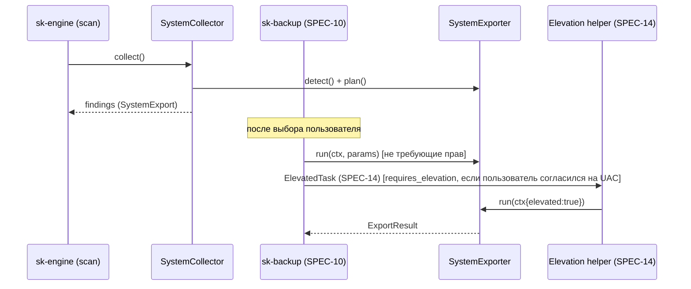

# SPEC-06: Системные экспорты

| Поле | Значение |
|---|---|
| ID | SPEC-06 |
| Статус | approved |
| Фаза | P1 |
| Крейт(ы) | `sk-system` |
| Зависит от | SPEC-01, SPEC-02, SPEC-03 |
| Используется в | SPEC-04 (`installed` условие), SPEC-09, SPEC-10 (выполнение экспортов), SPEC-13, SPEC-14 (elevation-хелпер) |
| Последнее изменение | 2026-10-03 (T-02-10: общий RegistryReader и PathTemplate::specialize в sk-core; §4.4: чтение Uninstall через `RegistryReader`, T-06-03 зависит от T-02-10); 2026-10-01 (решение по OEM-ключу) |

## 1. Цель

Сохранить системное состояние, которое нельзя получить простым копированием
пользовательских файлов: список программ для переустановки, ветки реестра, профили
Wi-Fi, драйверы, шрифты, hosts, переменные окружения, задачи планировщика и т.д. Плюс
сформировать **чек-лист** того, что не экспортируется файлами (лицензии, BitLocker, 2FA).
На скане экспортёры только определяют доступность и планируют находку. Сам экспорт
выполняется при бэкапе (SPEC-10).

## 2. Область

### 2.1 Входит
- Трейт `SystemExporter` и реестр экспортёров.
- `SystemCollector: Collector` (detect + plan).
- Сбор `Environment.installed_programs` (обогатитель в фазе Environment).
- Выполнение экспортов в каталог (`run`) — вызывается из SPEC-10.
- Запуск внешних процессов: таймауты, кодировки, без окна консоли.
- Чек-лист ручных действий (`checklist.md` в бэкапе).

### 2.2 Не входит
- Реестр конкретных программ (7-Zip, PuTTY): правила SPEC-04 с `Target::Registry`. Их экспорт выполняет **этот** крейт (`export_registry`, §4.5), SPEC-10 его вызывает.
- Восстановление (`winget import`, `netsh add profile`): SPEC-13.
- Механизм повышения прав (процесс-хелпер): SPEC-14. Здесь только контракт.

## 3. Требования

### 3.1 Функциональные
- **FR-06-01** — Каждый экспортёр реализует `detect()` (быстро, ≤ 500 мс, без побочных эффектов) и `plan()` (находка `Target::SystemExport`).
- **FR-06-02** — `run()` пишет результат **только** в переданный `target_dir` (P1) и возвращает список созданных файлов с хэшами.
- **FR-06-03** — Экспортёры, которым нужен админ, возвращают `Availability::NeedsElevation`, их находки получают `requires_elevation: true`. При бэкапе без прав они выполняются через хелпер (SPEC-14) или пропускаются с понятным сообщением.
- **FR-06-04** — Все внешние процессы запускаются с `CREATE_NO_WINDOW`, с таймаутом (по умолчанию 60 с, для драйверов 600 с), с отменой (kill дерева через Job Object) и с корректным декодированием вывода (§4.6).
- **FR-06-05** — Никакие ключи продуктов и лицензии не извлекаются (P6). OEM-ключ из BIOS тоже не извлекается: `windows-info` записывает только факт его наличия (`oem_key_in_firmware: true`), а `checklist.md` поясняет, что активация пройдёт автоматически.
- **FR-06-06** — Экспорт паролей Wi-Fi открытым текстом (`key=clear`) выполняется **только** при явном согласии в UI (чекбокс в находке, `params.include_keys = true`). Такая находка получает `sensitivity: High` и рекомендацию шифрования бэкапа (SPEC-10).
- **FR-06-07** — Список установленных программ собирается всегда (даже без winget) из Uninstall-ключей и сохраняется как `programs.csv` + `programs.html` (с поиском). Это база для ручной переустановки.
- **FR-06-08** — Чек-лист `checklist.md` генерируется всегда. В нём отмечено, что найдено (например, «BitLocker включён на C: — сохраните ключ восстановления из аккаунта Microsoft»).

### 3.2 Нефункциональные
- **NFR-06-01** — Весь `SystemCollector` на скане ≤ 3 с (без `winget export`, только `detect`).
- **NFR-06-02** — Независимость от локали Windows: не парсим локализованный вывод команд, где есть альтернатива (реестр/WMI/XML). Где нет, парсим только структурные части.

## 4. Дизайн

### 4.1 Публичный API

```rust
#[async_trait]
pub trait SystemExporter: Send + Sync {
    fn id(&self) -> &'static str;                       // "winget", "programs", "wifi", ...
    fn detect(&self, env: &Environment) -> Availability;
    fn plan(&self, env: &Environment, avail: &Availability) -> Option<Finding>;
    async fn run(&self, ctx: &ExportContext, params: &serde_json::Value) -> Result<ExportResult, ExportError>;
}

pub enum Availability {
    Available { estimated_bytes: Option<u64>, details: BTreeMap<String, String> },
    NeedsElevation { estimated_bytes: Option<u64> },
    Unavailable { reason_key: String },                 // winget не установлен и т.п. — находка не создаётся
}

pub struct ExportContext<'a> {
    pub env: &'a Environment,
    pub target_dir: &'a Path,                           // <backup>/system/<exporter_id>/
    pub cancel: &'a CancellationToken,
    pub events: &'a EventSink,
    pub elevated: bool,                                 // выполняемся ли в хелпере с правами
}

pub struct ExportResult {
    pub files: Vec<ExportedFile>,                       // относительные пути внутри target_dir
    pub warnings: Vec<ScanIssue>,
    pub restore_hint: RestoreHint,                      // для SPEC-13 / checklist
}
pub struct ExportedFile { pub rel_path: PathBuf, pub bytes: u64, pub blake3: String }
pub enum RestoreHint { Command { program: String, args: Vec<String> }, Manual { key: String }, None }

#[derive(thiserror::Error, Debug)]
pub enum ExportError { NotAvailable, NeedsElevation, Timeout, Cancelled, ProcessFailed { code: i32, stderr: String }, Io(std::io::Error) }

pub fn registry() -> Vec<Arc<dyn SystemExporter>>;       // все экспортёры §4.3
pub fn exporter(id: &str) -> Option<Arc<dyn SystemExporter>>;

pub struct SystemCollector { exporters: Vec<Arc<dyn SystemExporter>> }
impl Collector for SystemCollector { /* id() = "system" */ }

pub fn enrich(env: &mut Environment);                   // installed_programs (§4.4)

/// Экспорт ветки реестра для Target::Registry (используется SPEC-10 и для правил SPEC-04).
pub async fn export_registry(hive: RegHive, key: &str, out_file: &Path, cancel: &CancellationToken) -> Result<ExportedFile, ExportError>;

// Утилита запуска процессов (§4.6)
pub struct Cmd { /* program, args, timeout, cwd, env */ }
impl Cmd {
    pub fn new(program: &str) -> Self;
    pub fn args<I: IntoIterator<Item = S>, S: AsRef<OsStr>>(self, a: I) -> Self;
    pub fn timeout(self, d: Duration) -> Self;
    pub async fn run(self, cancel: &CancellationToken) -> Result<CmdOutput, ExportError>;
}
pub struct CmdOutput { pub code: i32, pub stdout: String, pub stderr: String }
```

Находка из `plan()`: `Target::SystemExport { exporter_id, params }`, `category: SystemSettings`
(кроме указанных в таблице), `app: AppRef { kind: System }`, evidence `EvidenceSource::System { exporter_id }`.

### 4.2 Поток



### 4.3 Каталог экспортёров

| id | Категория / sensitivity | detect | run (что делает) | Результат в `system/<id>/` | Права |
|---|---|---|---|---|---|
| `winget` | system_settings / none | `winget.exe` в `{LOCALAPPDATA}\Microsoft\WindowsApps` или PATH; `winget --version` ≥ 1.4 | `winget export -o <dir>\winget.json --include-versions --accept-source-agreements --disable-interactivity` (таймаут 180 с) | `winget.json` | нет |
| `programs` | system_settings / none | всегда | Из `Environment.installed_programs` | `programs.csv`, `programs.html` (+ колонка «есть в winget.json») | нет |
| `wifi` | system_settings / **high** если `include_keys` | `netsh wlan show interfaces` код 0 **или** наличие `{PROGRAMDATA}\Microsoft\Wlansvc\Profiles\Interfaces\*` | `netsh wlan export profile folder="<dir>" [key=clear]` | `Wi-Fi-<SSID>.xml` ×N | нет (без ключей), `key=clear` работает для текущего пользователя, но для некоторых профилей нужен админ → warning |
| `drivers` | system_settings / none | всегда на Windows; `estimated_bytes` = сумма `{WINDIR}\System32\DriverStore\FileRepository\oem*` через `pnputil /enum-drivers` count × ~5 МБ | `pnputil /export-driver * "<dir>"` (таймаут 600 с) | `oem*.inf` + файлы | **админ** |
| `registry-user` | system_settings / low | всегда | `reg export` веток: `HKCU\Control Panel\Keyboard`, `HKCU\Control Panel\Mouse`, `HKCU\Control Panel\International`, `HKCU\Keyboard Layout`, `HKCU\Software\Microsoft\Windows\CurrentVersion\Explorer\Advanced`, `HKCU\Console`, `HKCU\Software\Microsoft\Windows\CurrentVersion\Run` | `*.reg` ×N | нет |
| `env-vars` | system_settings / low | всегда | Чтение `HKCU\Environment` через `winreg` → JSON + `reg export`. Системные (`HKLM\SYSTEM\CurrentControlSet\Control\Session Manager\Environment`) → JSON только для справки | `user-env.json`, `user-env.reg`, `system-env.json` | нет |
| `fonts` | system_settings / none | `{LOCALAPPDATA}\Microsoft\Windows\Fonts` непуст **или** `HKCU\Software\Microsoft\Windows NT\CurrentVersion\Fonts` непуст | Копирование шрифтов пользователя + `reg export` HKCU Fonts. Системные шрифты не из поставки Windows (`{WINDIR}\Fonts`, не подписанные Microsoft по списку имён) → только список `system-fonts-nonstandard.txt` | `user/*.ttf|otf`, `fonts.reg`, `.txt` | нет |
| `hosts` | system_settings / none | `{WINDIR}\System32\drivers\etc\hosts` отличается от дефолта (есть непустые строки без `#`) | Копирование | `hosts` | нет |
| `scheduled-tasks` | system_settings / low | `schtasks /query /fo csv /nh` → задачи вне `\Microsoft\` | `schtasks /query /xml /tn <name>` для каждой пользовательской | `tasks/<name>.xml` | нет (часть задач скрыта без админа → info) |
| `powershell-modules` | dev_environment / none | `{DOCUMENTS}\PowerShell\Modules` или `{DOCUMENTS}\WindowsPowerShell\Modules` непусты | Список модулей (`name, version` из `*.psd1` → `ModuleVersion`) + опционально копирование (если нет в PSGallery — определить нельзя, копируем всё ≤ 200 МБ) | `modules.json`, `Modules/**` | нет |
| `printers` | system_settings / none | WMI `Win32_Printer` count > 0 (кроме встроенных `Microsoft Print to PDF`, `OneNote`, `Fax`, `XPS`) | Только инфо: имя, драйвер, порт | `printers.json` | нет |
| `disks-info` | system_settings / none | всегда | `DriveInfo` + BitLocker-статус (`manage-bde -status` → только если админ; иначе WMI `Win32_EncryptableVolume` (требует админ) → «неизвестно») | `disks.json` | частично |
| `windows-info` | system_settings / none | всегда | Версия, редакция, язык, имя ПК, **статус активации** (`slmgr`-аналог через WMI `SoftwareLicensingProduct.LicenseStatus` для Windows) — без ключей | `windows.json` | нет |
| `checklist` | system_settings / none | всегда | Генерация `checklist.md` по §4.7 | `checklist.md` | нет |
| `git-bundle` | dev_environment / low | Не планируется самостоятельно: находки создаёт SPEC-07 §4.4.4 (дочерние к репозиторию). Доступен, если есть `git.exe` в PATH | `git -C <repo> bundle create <dir>\<slug>.bundle --all` + копирование dirty/untracked файлов в `<slug>-worktree/` (по `git status --porcelain=v1 -z`) | `<slug>.bundle`, `<slug>-worktree/**` | нет |

Параметры (`params`) по экспортёрам: `git-bundle: { repo: PathTemplate }`, `wifi: { include_keys: bool }`, `drivers: { only_third_party: true }`, `powershell-modules: { copy_files: bool }`. Параметры меняются в UI (SPEC-11) до бэкапа и сохраняются в выборе.

### 4.4 Installed programs (`enrich`)
Источники (объединение, дедуп по `(DisplayName, Publisher)` lowercase):
- `HKLM\SOFTWARE\Microsoft\Windows\CurrentVersion\Uninstall\*`
- `HKLM\SOFTWARE\WOW6432Node\Microsoft\Windows\CurrentVersion\Uninstall\*`
- `HKCU\Software\Microsoft\Windows\CurrentVersion\Uninstall\*`
- MSIX/Store-пакеты: `Get-AppxPackage` дорог → вместо него перечисление `HKCU\Software\Classes\Local Settings\Software\Microsoft\Windows\CurrentVersion\AppModel\Repository\Packages\*` (имя PFN, без системных `Microsoft.Windows.*`, `*.NET.*`, `VCLibs`).

Фильтр: пропускаем `SystemComponent = 1`, записи с `ParentKeyName` (обновления), `ReleaseType ∈ {Update, Hotfix, Security Update}`, без `DisplayName`.

Чтение — через `sk_core::registry::RegistryReader` (SPEC-02 §3.4: `subkeys`, `string_value`, `dword_value`), тесты фильтров — на `MemRegistry`.

```rust
// Тип определяется в sk-core (SPEC-02 §3.3 Environment.installed_programs)
pub struct InstalledProgram {
    pub name: String, pub publisher: Option<String>, pub version: Option<String>,
    pub install_location: Option<PathBuf>, pub install_date: Option<String>,
    pub estimated_size_kb: Option<u64>, pub source: ProgramSource, // Hklm | Hklm32 | Hkcu | Msix
    pub uninstall_key: String,
}
```

`install_location` используется SPEC-07 для пометки `Reinstallable`.

### 4.5 Экспорт реестра
- Предпочтительно `reg.exe export "<HIVE>\<key>" "<file>" /y`. Формат `.reg` (UTF-16LE с BOM) — стандартный, восстанавливается двойным кликом.
- Имя файла: `slug(key).reg`, коллизии получают суффикс `-2`.
- Ключ не существует → `ExportError::NotAvailable` (не ошибка бэкапа, warning).
- Альтернатива без процесса (если `reg.exe` заблокирован политикой): собственный сериализатор через `winreg` в формат `Windows Registry Editor Version 5.00` — желательно, T-06-10.

### 4.6 Запуск процессов (`Cmd`)
1. `tokio::process::Command` с `creation_flags(CREATE_NO_WINDOW | CREATE_NEW_PROCESS_GROUP)`.
2. Процесс помещается в Job Object с `JOB_OBJECT_LIMIT_KILL_ON_JOB_CLOSE` → при отмене или таймауте убивается всё дерево (winget порождает дочерние процессы).
3. Программы вызываются по **полному пути** (`{WINDIR}\System32\reg.exe`, `netsh.exe`, `pnputil.exe`, `schtasks.exe`), не через PATH (защита от подмены). Для `winget` путь из detect.
4. **Кодировка вывода:**
   - `winget`: UTF-8 (при `--disable-interactivity`), дополнительно env `WINGET_DISABLE_VT=1`? — не нужен, парсим только код выхода и файл.
   - `netsh`, `schtasks`, `pnputil`, `reg`: вывод в OEM codepage консоли. Процесс без консоли получает `GetOEMCP()`. Декодируем через `encoding_rs` по `GetOEMCP()` (866 для ru-RU, 437 для en-US), fallback UTF-8 lossy. **Не** вызываем `chcp` (меняет состояние консоли пользователя, если CLI запущен в терминале).
   - Где возможно, используем структурный вывод (`/fo csv`, `/xml`, файлы экспорта), а не текст (NFR-06-02).
5. stdout/stderr ограничены 16 МБ (защита памяти), лишнее отбрасывается с флагом.
6. Логи: команда и аргументы (обезличенные), код выхода, время. Вывод пишется в лог только при ошибке.

### 4.7 Чек-лист (`checklist.md`)
Генерируется из шаблона (i18n ru/en) с подстановкой фактов:
- **Аккаунты и 2FA:** «Проверьте, что у вас есть доступ к резервным кодам 2FA», если найдены находки `credentials` или приложения-аутентификаторы (WinAuth, Authy — по `installed_programs`).
- **BitLocker:** если диск зашифрован (или статус неизвестен): «Сохраните ключ восстановления: account.microsoft.com/devices/recoverykey».
- **Лицензии:** список программ из `installed_programs` с известной моделью лицензирования (Adobe, JetBrains, Microsoft Office, игры вне лаунчеров) из встроенного списка `licensing-hints.yaml` → «деактивируйте перед переустановкой / войдите в аккаунт».
- **Windows:** «Активация привязана к цифровой лицензии / аккаунту Microsoft» (по статусу из `windows-info`).
- **Браузеры:** «Включите синхронизацию. Пароли Chromium не переносятся файлами» (если есть находки browsers из SPEC-04).
- **Незапушенные git-репозитории:** ссылка на находки SPEC-07.
- **Облачные файлы только онлайн:** если `cloud_only` > 0 (SPEC-03).
- **Драйверы:** «экспорт требует прав администратора» (если не выполнен).

### 4.8 Конфигурация
Отдельных ключей в конфиге v1 нет. Включение/выключение коллектора через `ScanOptions.collectors.system`, параметры экспортёров через выбор в UI. Возможное будущее: `system.disabled_exporters: []` (Открытые вопросы).

## 5. Ошибки и граничные случаи

| Ситуация | Поведение |
|---|---|
| winget не установлен (LTSC, старые Win10) | `Unavailable { reason_key: "system.winget.missing" }`. `programs` всё равно работает. Чек-лист: «установите App Installer». |
| winget требует принять соглашения / первый запуск | `--accept-source-agreements --disable-interactivity`. При коде ≠ 0 и пустом файле → warning. |
| winget export пропустил пакеты («not available from any source») | Нормально. `programs.html` показывает всё, колонка «в winget». |
| Wi-Fi-адаптера нет (ПК по кабелю) | `detect` по `Profiles\Interfaces` → профилей нет → Unavailable. |
| Групповая политика запрещает `reg.exe` | Fallback-сериализатор (T-06-10) или warning. |
| Нет прав на драйверы | NeedsElevation. Без согласия на UAC → находка пропускается при бэкапе, пункт чек-листа. |
| UAC отклонён пользователем | `ExportError::NeedsElevation` → warning, бэкап продолжается. |
| Экспорт завис (winget иногда висит на сети) | Таймаут → kill Job → warning. |
| Имя SSID с символами, недопустимыми в имени файла | netsh сам заменяет. Мы не переименовываем. |
| Отмена бэкапа посреди `pnputil` | Kill Job. Частичные файлы в `system/drivers` помечаются в манифесте как `incomplete` (SPEC-10). |
| Не-Windows (CI Linux) | `registry()` возвращает экспортёры, но `detect` → `Unavailable { "system.not_windows" }`. Тесты используют фейковый `Cmd`. |

## 6. Тестирование

- **Абстракция процессов:** трейт `CmdRunner` (реальный/фейковый) внутри крейта, чтобы тестировать экспортёры без Windows: фейк возвращает заготовленный stdout/файлы.
- Unit: декодирование OEM (фикстуры вывода `schtasks /fo csv` в cp866 и cp437), фильтр Uninstall-записей (фикстура JSON-дампа ключей), генерация `programs.csv/html`, генерация `checklist.md` (snapshot `insta` для набора фактов).
- Unit: `plan()` для каждого экспортёра (категория, sensitivity, requires_elevation).
- **Windows-интеграционные (`#[cfg(windows)]`):**
  - `export_registry(HKCU, "Control Panel\\Mouse")` → валидный `.reg` (BOM UTF-16LE, заголовок).
  - `env-vars` → JSON содержит `Path`.
  - `Cmd` с таймаутом на `ping -n 30 127.0.0.1` → Timeout за ≤ таймаут + 1 с, процесса нет.
  - `winget` и `wifi` — `#[ignore]`, ручной прогон (зависят от машины).
- Проверка P1: после `run` каждого экспортёра в tempdir нет файлов вне `target_dir` (walk всего tempdir-родителя).

## 7. Задачи

- [ ] **T-06-01** — Трейт `SystemExporter`, `Availability`, `ExportContext`, `ExportResult`, `registry()`. *Зависит:* T-02-01. *Готово, когда:* компилируется, документация.
- [ ] **T-06-02** — `Cmd` + `CmdRunner`: `CREATE_NO_WINDOW`, Job Object, таймаут, отмена, OEM-декодирование, лимиты вывода. *Зависит:* T-06-01. *Готово, когда:* Windows-тест таймаута и unit-тест декодирования.
- [ ] **T-06-03** — `enrich`: installed programs (4 источника, фильтры, дедуп). *Зависит:* T-02-05, T-02-10. *Готово, когда:* unit на фикстуре + ручная сверка с «Приложения и возможности».
- [ ] **T-06-04** — `SystemCollector` (detect+plan параллельно, ≤ 3 с). *Зависит:* T-06-01, T-01-03.
- [ ] **T-06-05** — Экспортёры `programs`, `winget`. *Зависит:* T-06-02, T-06-03.
- [ ] **T-06-06** — `export_registry` + экспортёры `registry-user`, `env-vars`. *Зависит:* T-06-02.
- [ ] **T-06-07** — Экспортёр `wifi` (с параметром `include_keys`, sensitivity). *Зависит:* T-06-02.
- [ ] **T-06-08** — Экспортёры `fonts`, `hosts`, `scheduled-tasks`, `powershell-modules`. *Зависит:* T-06-02.
- [ ] **T-06-09** — Экспортёры `drivers` (NeedsElevation), `printers`, `disks-info`, `windows-info` (WMI через `wmi` crate). *Зависит:* T-06-02.
- [ ] **T-06-10** — Fallback-сериализатор `.reg` через `winreg` (желательно). *Зависит:* T-06-06.
- [ ] **T-06-11** — `checklist` + `licensing-hints.yaml` (≥ 30 программ) + i18n ru/en. *Зависит:* T-06-03, T-06-09.
- [ ] **T-06-12** — Интеграция с elevation-хелпером через `sk-core::win::elevation::ElevatedTask` (SPEC-14 §4). Соответствие: `drivers` → `ElevatedTask::ExportDrivers { out_dir }`. Прочие экспортёры админских прав не требуют; частично-админские (`disks-info`, `wifi` с ключами) при отсутствии прав деградируют с warning, а не просят UAC. Новый тип задачи добавляется только одновременной правкой SPEC-06 и SPEC-14. *Зависит:* T-06-01, T-14-05.
- [ ] **T-06-13** — Экспортёр `git-bundle` (§4.3). *Зависит:* T-06-01, T-07-10. *Готово, когда:* Windows-тест на временном репозитории с незапушенным коммитом и untracked-файлом: bundle клонируется, файлы на месте.

## 8. Критерии приёмки

- [ ] На Windows 11 без прав админа: скан показывает все экспортёры §4.3 с корректной доступностью, `drivers` помечен «нужны права».
- [ ] Бэкап (через SPEC-10) создаёт `system/winget/winget.json`, `system/programs/programs.html`, `system/checklist/checklist.md`, и `winget import` на чистой VM ставит программы из списка.
- [ ] Wi-Fi-пароли не попадают в бэкап без явного согласия (тест: `include_keys=false` → в XML нет `<keyMaterial>`).
- [ ] Ни одно окно консоли не мигает при экспорте из GUI.
- [ ] Отмена во время `winget export` завершает процесс winget за ≤ 2 с.

## 9. Открытые вопросы

- **OEM-ключ Windows из BIOS** (`SoftwareLicensingService.OA3xOriginalProductKey` через WMI): полезен владельцам старых ноутбуков, но это извлечение ключа, что противоречит FR-06-05. **Решено (2026-10-01):** не извлекать. Показываем только факт наличия (`OA3xOriginalProductKey != ""`) в `windows.json` и в чек-листе.
- **Предложение к SPEC-02 §3.3:** тип `InstalledProgram` (§4.4) определить в `sk-core` как часть `Environment` (сейчас там упомянут без определения).
- **Предложение к SPEC-02 §2.1 / SPEC-10:** у находки `SystemExport` нужны редактируемые параметры (`include_keys`). Нужен ли отдельный тип `ExportParamsSchema` для UI (JSON-schema параметров экспортёра)? Предложение: метод `fn params_schema(&self) -> Option<ParamsSchema>` в трейте + отображение в SPEC-11.
- ~~Предложение к SPEC-01 §4.8.2: `system.disabled_exporters`, `system.winget_timeout_s`~~. **Принято** (SPEC-01 §4.8.2, таймаут по умолчанию 180 с).
- Экспорт ассоциаций файлов по умолчанию (`dism /online /export-defaultappassociations`) требует админа и плохо восстанавливается на Win11. Включить как `NeedsElevation`-экспортёр или только в чек-лист? Предложение: только чек-лист.
- Нужен ли экспорт WSL (`wsl --export`)? Это SPEC-18 (бэклог), здесь только detect → пункт чек-листа «найдено N WSL-дистрибутивов».
