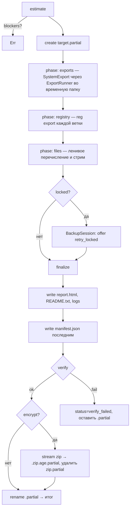

# SPEC-10: Бэкап

| Поле | Значение |
|---|---|
| ID | SPEC-10 |
| Статус | approved |
| Фаза | P3 |
| Крейт(ы) | `sk-backup` (оркестрация — `sk-engine::BackupJob`) |
| Зависит от | SPEC-01, SPEC-02, SPEC-03, SPEC-06, SPEC-09 |
| Используется в | SPEC-11, SPEC-13, SPEC-14 |
| Последнее изменение | 2026-09-28 |

## 1. Цель

Записать выбранные пользователем находки в один переносимый бэкап: zip-архив или папку.
В бэкап входят машиночитаемый `manifest.json` (для верификации и восстановления, SPEC-13)
и самодостаточный `report.html` для человека. Запись атомарна, отменяема и верифицируема.
Заблокированные файлы не ломают бэкап: они попадают в отчёт с подсказкой, что закрыть.

## 2. Область

### 2.1 Входит
- Форматы `zip` (deflate, zip64) и `dir` (обычная папка).
- Ленивое перечисление файлов `FileSet`/`File`, экспорт `Registry`, выполнение `SystemExport` (через SPEC-06).
- Структура бэкапа, схема `manifest.json` v1.
- Предварительная оценка: размер, свободное место, ограничения ФС назначения (FAT32).
- Заблокированные файлы: режимы шаринга, ретраи, определение процессов-блокировщиков (Restart Manager).
- Атомарность (`.partial` + rename), отмена, прогресс.
- Верификация после записи (blake3).
- Шифрование всего архива через `age` (passphrase/scrypt).
- `report.html` и `README.txt`.

### 2.2 Не входит
- Восстановление: SPEC-13.
- VSS-снимки для заблокированных файлов: SPEC-15 (бэклог).
- Разбиение архива на тома, инкрементальные бэкапы: SPEC-19 (бэклог).
- Облачные назначения (Google Drive и т.п.). Пишем только в локальный или смонтированный путь.

## 3. Требования

### 3.1 Функциональные
- **FR-10-01** — Бэкап содержит только находки из `selection`. Каждая находка лежит в своей подпапке `files/<FindingId>/`.
- **FR-10-02** — Для каждого файла в манифесте записываются: шаблон исходного пути, путь в архиве, размер, mtime, атрибуты, blake3.
- **FR-10-03** — До старта выполняется `estimate()`: суммарный размер (из `TargetStats`, SPEC-02 §2.6), свободное место, ограничения ФС. Если места не хватает, запуск отклоняется с ошибкой `InsufficientSpace`.
- **FR-10-04** — Формат `zip` на FAT32 при наличии файла > 4 ГиБ − 1 или итоговом архиве > 4 ГиБ − 1 отклоняется с `FsLimit`. UI предлагает `dir` (но и `dir` не примет файл > 4 ГиБ на FAT32) или диск exFAT/NTFS.
- **FR-10-05** — Файлы открываются с `FILE_SHARE_READ | FILE_SHARE_WRITE | FILE_SHARE_DELETE` и `FILE_FLAG_BACKUP_SEMANTICS` (без требования привилегии). При `ERROR_SHARING_VIOLATION`/`ERROR_LOCK_VIOLATION` делается до 3 ретраев с задержкой 200/500/1000 мс. Потом файл записывается в `locked` с процессами-блокировщиками (FR-10-06).
- **FR-10-06** — Для заблокированных файлов через Restart Manager (`RmStartSession`, `RmRegisterResources`, `RmGetList`) определяются процессы (имя, PID, `strAppName`). После записи основного объёма предлагается «Повторить заблокированные» (UI SPEC-11).
- **FR-10-07** — Запись идёт в `<target>.partial` (файл zip или папка). Только после успешного завершения (и верификации, если включена) выполняется rename в итоговое имя. Если прерванный `.partial` найден при следующем запуске, UI предлагает удалить его.
- **FR-10-08** — Отмена прекращает запись за ≤ 1 с. `.partial` удаляется (по умолчанию) или сохраняется с `manifest.json`, где `status: "incomplete"` (опция `keep_partial_on_cancel`).
- **FR-10-09** — Верификация (по умолчанию включена, `config.backup.verify`): повторное чтение каждой записи из архива или папки, пересчёт blake3 и сравнение с манифестом. Расхождение делает бэкап невалидным: `status: "verify_failed"`, `.partial` не переименовывается.
- **FR-10-10** — Шифрование (опция): итоговый zip шифруется потоково в `<name>.zip.age` (age, recipient scrypt passphrase). Незашифрованная копия на диск не пишется. Формат `dir` + шифрование не поддерживается (UI блокирует комбинацию).
- **FR-10-11** — `report.html` самодостаточен (инлайн CSS, без JS или с минимальным инлайн JS, без сетевых ресурсов). Содержит: сводку, список сохранённого, пропущенные и заблокированные файлы, ошибки, **чек-лист ручных действий** (§4.8).
- **FR-10-12** — В бэкап пишется `README.txt` (ru+en): что это, как восстановить SaveKeeper'ом, как вручную.
- **FR-10-13** — Прогресс: `Event::BackupProgress` (SPEC-01 §4.5) с троттлингом, по байтам и файлам. Системные экспорты считаются как 1 «файл» с неизвестным размером до выполнения.
- **FR-10-14** — Имя по умолчанию: `SaveKeeper-<MACHINE>-<YYYYMMDD-HHMM>.zip` (или папка без расширения). Недопустимые символы заменяются на `_`.

### 3.2 Нефункциональные
- **NFR-10-01** — Пропускная способность ≥ 80% от скорости последовательного копирования диска для крупных файлов (уровень сжатия 6). Уже сжатые форматы (`.zip .7z .rar .jpg .png .mp4 .mkv .mp3 .gz .zst .pak`) пишутся методом `Stored`.
- **NFR-10-02** — Память ≤ 200 МБ независимо от размера бэкапа. Файлы стримятся буфером 1 МиБ, список файлов в памяти не держится (кроме записей манифеста, ~200 байт на файл).
- **NFR-10-03** — Zip открывается встроенным Проводником Windows 10/11 и 7-Zip. Для zip64 с Проводником проверено (Win10 22H2+ поддерживает zip64 на чтение).
- **NFR-10-04** — Имена в zip хранятся в UTF-8 с флагом EFS (bit 11), разделитель `/`.
- **NFR-10-05** — Принцип P1: ни один исходный файл не открывается на запись и не модифицируется (в том числе не меняется atime; используем `FILE_READ_ATTRIBUTES | GENERIC_READ`).

## 4. Дизайн

### 4.1 Публичный API

```rust
// sk-backup
pub struct BackupRequest {
    pub report: Arc<ScanReport>,           // SPEC-02 §6
    pub selection: BTreeSet<FindingId>,    // выбранные находки
    pub target: BackupTarget,
    pub options: BackupOptions,
}

pub struct BackupTarget {
    pub parent_dir: PathBuf,               // куда писать
    pub name: String,                      // без расширения; расширение добавляется по формату
}

pub struct BackupOptions {
    pub format: BackupFormat,              // Zip | Dir
    pub compression_level: u8,             // 0..=9, из config.backup.compression_level
    pub encryption: Option<Passphrase>,    // только для Zip; Passphrase = secrecy::SecretString
    pub verify: bool,
    pub keep_partial_on_cancel: bool,
    pub retry_locked: RetryPolicy,         // {attempts: 3, delays_ms: [200, 500, 1000]}
}

pub struct BackupEstimate {
    pub total_bytes: u64,                  // сумма TargetStats.total_bytes выбранного (+ оценка экспортов)
    pub file_count: u64,
    pub estimated_archive_bytes: u64,      // total_bytes * коэффициент сжатия по категориям (§4.6)
    pub free_bytes: u64,
    pub fs_kind: FsKind,                   // Ntfs | ExFat | Fat32 | ReFs | Network | Other(String)
    pub largest_file_bytes: Option<u64>,   // если известно из скана, иначе None
    pub blockers: Vec<EstimateBlocker>,    // InsufficientSpace | FsLimit{..} | TargetInsideSource{finding} | EncryptWithDir | NotWritable
    pub warnings: Vec<EstimateWarning>,    // Sensitive{count} | RequiresElevation{ids} | LargeSelection | TargetOnSystemDrive
}

pub fn estimate(req: &BackupRequest) -> Result<BackupEstimate, BackupError>;

pub struct BackupResult {
    pub output_path: PathBuf,              // итоговый файл/папка
    pub manifest: BackupManifest,          // §4.4
    pub status: BackupStatus,              // Complete | CompleteWithIssues | Incomplete | VerifyFailed
}

// Реализация в sk-backup, вызывается из sk-engine::BackupJob::run
pub async fn run_backup(req: BackupRequest, exporters: &dyn ExportRunner, events: EventSink, cancel: CancellationToken)
    -> Result<BackupResult, BackupError>;

/// Абстракция над SPEC-06, чтобы тестировать без реальных winget/netsh.
#[async_trait]
pub trait ExportRunner: Send + Sync {
    /// Выполняет экспорт в out_dir (SPEC-06 §4.1 SystemExporter::run). Возвращает созданные файлы.
    async fn run(&self, exporter_id: &str, params: &serde_json::Value, out_dir: &Path, cancel: &CancellationToken)
        -> Result<Vec<PathBuf>, ExportError>;
    fn requires_elevation(&self, exporter_id: &str) -> bool;
}

/// Повтор только для заблокированных файлов из результата (FR-10-06). Работает с .partial до финализации.
pub async fn retry_locked(session: &mut BackupSession, events: EventSink, cancel: CancellationToken) -> Result<RetryOutcome, BackupError>;
```

`sk-engine::BackupJob::run(report, selection, target, events, cancel)` (SPEC-01 §4.4)
собирает `BackupRequest` из конфига и передаёт в `run_backup` с `ExportRunner` из `sk-system`.

`BackupSession` — внутреннее состояние между фазами «запись» и «финализация». Благодаря ему
UI может предложить повтор заблокированных до финализации. Жизненный цикл:
`open → write_all → [retry_locked]* → finalize (manifest, report, verify, encrypt, rename)`.
В простом API `run_backup` это делается целиком. Для UI есть разбитый API:

```rust
pub async fn begin(req: BackupRequest, ...) -> Result<BackupSession, BackupError>;   // до конца write_all
pub async fn finalize(session: BackupSession, ...) -> Result<BackupResult, BackupError>;
pub fn abort(session: BackupSession, keep_partial: bool) -> Result<(), BackupError>;
```

### 4.2 Структура бэкапа

```
SaveKeeper-DESKTOP-01-20260928-1430.zip      (или папка с тем же содержимым)
├── manifest.json            # §4.4 — пишется последним (в zip — последней записью)
├── report.html              # §4.8
├── README.txt               # FR-10-12
├── files/
│   ├── 3fa2c9e01b7d44aa/     # FindingId (SPEC-02 §2.7)
│   │   └── <относительные пути от корня FileSet>
│   │       └── SL2/ER0000.sl2
│   └── 91bd0f7e2c3a1188/     # Target::File → один файл с исходным именем
│       └── settings.json
├── registry/
│   └── 5c1e.. .reg          # <FindingId>.reg, UTF-16LE с BOM (формат reg.exe export)
├── system/
│   ├── winget/
│   │   └── winget-export.json
│   ├── wifi/
│   │   └── Wi-Fi-HomeNet.xml
│   └── <exporter_id>/...    # то, что вернул ExportRunner
└── logs/
    └── backup.log           # обезличенный лог сессии бэкапа
```

- Пути внутри `files/<id>/` — это относительные пути от `resolved` корня `FileSet`, с разделителем `/`.
- Для `Target::File` внутри `files/<id>/` лежит один файл с исходным именем.
- Имена, недопустимые в zip или на целевой ФС (`CON`, `aux.txt`, завершающие точки и пробелы), экранируются: `CON` → `CON~sk`. Исходное имя сохраняется в манифесте (`original_name`).
- Файлы выбранной находки, которые попадают под другую выбранную находку (вложенность), пишутся **один раз**, в самую специфичную находку. Слияние выполнено в SPEC-09 (`children`), но `sk-backup` дополнительно проверяет дубли через `PathSet` (SPEC-01 §4.3).

### 4.3 Алгоритм записи



1. **Порядок фаз:** экспорты → реестр → файлы. Экспорты быстрые, и если что-то пойдёт не так, пользователь узнает об этом рано. Экспорт, требующий прав (`requires_elevation` и `!env.is_elevated`), выполняется через elevation-хелпер (SPEC-14 §4.5). Если пользователь отказал в UAC, экспорт записывается в `errors` с кодом `elevation_denied`, бэкап продолжается.
2. **Реестр:** `reg.exe export "<HIVE>\<key>" <tmp>.reg /y` (надёжнее и совместимее собственного сериализатора). `recursive=false` не поддерживается `reg.exe`. В этом случае используется собственный экспорт значений ключа через `winreg` в формат `.reg` v5 (функция `write_reg_values`). Код выхода ≠ 0 записывается в `errors`.
3. **Файлы:** для каждой находки в порядке `category order → score desc` (важное первым: при нехватке времени и отмене важное уже записано):
   - перечисление через `FsScanner::walk(root, include, exclude)` (SPEC-03 §4.1) — итератор, без материализации списка;
   - символические ссылки и junction не разыменовываются (как в SPEC-03, `follow_symlinks=false`). Ссылка записывается в манифест как `kind: "symlink"` с `link_target`, но содержимое не копируется;
   - открытие файла по FR-10-05, стрим в `zip::ZipWriter` (`large_file(true)` для > 4 ГиБ) или `std::io::copy` в папку. blake3 считается «на лету» тем же проходом (`Hasher` как `Write`-tee);
   - после копирования проверяется, что `mtime` и размер не изменились во время чтения. Если изменились, запись получает флаг `changed_during_read` и предупреждение (файл всё равно сохранён);
   - mtime и атрибуты: zip хранит mtime в extended timestamp (0x5455) и NTFS extra field (0x000a). Для `dir` выставляются `SetFileTime` и атрибуты `READONLY|HIDDEN|SYSTEM|ARCHIVE`.
4. **Проверка отмены** — между файлами и каждые 8 МиБ внутри большого файла.

### 4.4 manifest.json v1

```jsonc
{
  "format": "savekeeper-backup",
  "schema_version": 1,
  "status": "complete",                 // complete | complete_with_issues | incomplete | verify_failed
  "backup_id": "7b1c1f4e-...-uuid",
  "scan_id": "a1b2...-uuid",            // из ScanReport
  "app_version": "0.1.0+g1a2b3c4",
  "created_at": "2026-09-28T14:30:12Z",
  "finished_at": "2026-09-28T14:41:57Z",
  "container": { "format": "zip", "encrypted": false, "compression_level": 6 },
  "environment": {                      // EnvironmentSnapshot (SPEC-02 §6), обезличенный
    "os": { "product": "Windows 11 Pro", "build": "26100.2033", "arch": "x86_64", "ui_language": "ru-RU" },
    "machine_name": "DESKTOP-01",
    "known_folders": { "DOCUMENTS": "{ONEDRIVE}\\Документы", "SAVED_GAMES": "{HOME}\\Saved Games" },
    "launchers": [{ "id": "steam", "root": "{PROGRAMFILES_X86}\\Steam" }]
  },
  "findings": [                         // снапшот выбранных Finding (SPEC-02 §2.1), без resolved-путей
    {
      "id": "3fa2c9e01b7d44aa",
      "title": "ELDEN RING — сохранения",
      "category": "game_save",
      "app": { "id": "elden-ring", "name": "ELDEN RING", "kind": "game", "source_ids": { "steam": "1245620" } },
      "target": { "kind": "file_set", "root": "{APPDATA}\\EldenRing", "include": [], "exclude": [] },
      "sensitivity": "none",
      "archive_dir": "files/3fa2c9e01b7d44aa",
      "stats": { "total_bytes": 28311552, "file_count": 4 },
      "status": "complete"              // complete | partial (есть locked/errors) | failed | skipped
    },
    {
      "id": "5c1e0a9d3b2f7e61",
      "title": "PuTTY — сессии",
      "category": "app_config",
      "target": { "kind": "registry", "hive": "hkcu", "key": "Software\\SimonTatham\\PuTTY", "recursive": true },
      "archive_path": "registry/5c1e0a9d3b2f7e61.reg",
      "status": "complete"
    }
  ],
  "entries": [                          // один объект на файл; порядок = порядок записи
    {
      "finding_id": "3fa2c9e01b7d44aa",
      "kind": "file",                   // file | dir (пустая папка) | symlink
      "source": "{APPDATA}\\EldenRing\\76561198000000000\\ER0000.sl2",
      "archive_path": "files/3fa2c9e01b7d44aa/76561198000000000/ER0000.sl2",
      "original_name": null,            // заполняется, если имя экранировано
      "size": 28311552,
      "mtime": "2026-09-27T22:10:04.123Z",
      "ctime": "2025-03-01T10:00:00Z",
      "attributes": ["archive"],        // readonly | hidden | system | archive
      "blake3": "b3f1…64hex",
      "flags": []                       // changed_during_read | non_utf8_path | name_escaped
    }
  ],
  "exports": [
    {
      "finding_id": "e0c47a1f9b8d2233",
      "exporter_id": "winget",
      "params": {},
      "files": [{ "archive_path": "system/winget/winget-export.json", "size": 18211, "blake3": "…" }],
      "status": "complete",             // complete | failed | elevation_denied | unavailable
      "elevated": false
    }
  ],
  "locked": [                           // не удалось прочитать из-за блокировки
    { "finding_id": "…", "source": "{LOCALAPPDATA}\\Google\\Chrome\\User Data\\Default\\History",
      "processes": [{ "name": "chrome.exe", "pid": 1234, "app_name": "Google Chrome" }] }
  ],
  "errors": [
    { "finding_id": "…", "source": "{HOME}\\…", "code": "access_denied", "message": "Access is denied. (os error 5)" }
  ],
  "totals": { "files": 18234, "bytes": 3221225472, "archive_bytes": 1987654321, "locked": 1, "errors": 1 },
  "verification": { "performed": true, "ok": true, "checked_files": 18234, "mismatches": [] }
}
```

- Для `manifest.json` генерируется JSON Schema (`schemars`) в `specs/schemas/backup-manifest-v1.schema.json`. Этот файл — контракт для SPEC-13.
- `source` всегда `PathTemplate` (SPEC-02 §3). Абсолютные пути с именем пользователя в манифест не попадают.
- Коды ошибок (`code`): `access_denied`, `not_found`, `locked`, `io`, `path_too_long`, `name_invalid`, `export_failed`, `elevation_denied`, `cancelled`.
- Типы в Rust: `BackupManifest`, `ManifestFinding`, `ManifestEntry`, `ManifestExport`, `LockedEntry`, `ManifestError`, `Verification` — `serde` + `specta`.
- Большие манифесты (≥ 100 тыс. записей) пишутся потоково: записи `entries` накапливаются во временном файле JSON Lines (`.partial/entries.jsonl`) и при финализации склеиваются в итоговый JSON без загрузки в память.

### 4.5 Заблокированные файлы и Restart Manager

```rust
// sk-backup::win::rm
pub fn find_lockers(paths: &[PathBuf]) -> Result<Vec<(PathBuf, Vec<LockingProcess>)>, RmError>;
pub struct LockingProcess { pub pid: u32, pub name: String, pub app_name: String, pub app_type: RmAppType }
```
- Одна RM-сессия на батч до 64 путей. `RmGetList` вызывается повторно при `ERROR_MORE_DATA`.
- Процессы группируются по приложению. UI показывает: «Закройте Google Chrome (3 файла) и нажмите "Повторить"».
- SaveKeeper **никогда** не завершает чужие процессы сам (без `RmShutdown`).
- Частые случаи (для подсказок в i18n): браузеры (профиль), Steam (`config/*.vdf`), Discord, Outlook (`.ost/.pst`), запущенные игры.

### 4.6 Оценка размера и места
- `total_bytes` — сумма `TargetStats.total_bytes` выбранных находок (уже без дублей вложенности). Если `stats == None`, находка считается «неизвестного размера» и получает предупреждение.
- Коэффициенты сжатия для `estimated_archive_bytes`: `GameSave 0.6`, `AppConfig 0.3`, `AppData 0.7`, `UserFiles 0.95`, `DevEnvironment 0.5`, прочие `0.8`. Это грубая оценка для UI.
- Свободное место: `GetDiskFreeSpaceExW(parent_dir)` → `free_bytes`. Для zip требуется `free ≥ estimated_archive_bytes × 1.1 + 50 МиБ`; для `dir` — `total_bytes × 1.05 + 50 МиБ`. С шифрованием: так как .age пишется потоком из zip.partial, нужно место на **оба** файла одновременно — `× 2` (открытый вопрос §9: потоковое шифрование без промежуточного zip).
- ФС: `GetVolumeInformationW` → имя ФС. `FAT32`: проверка FR-10-04 по `largest_file_bytes` (если скан его знает) и по `estimated_archive_bytes`.
- `TargetInsideSource`: если `parent_dir` лежит внутри корня какой-либо выбранной `FileSet`, это блокер (иначе бэкап попадёт сам в себя).
- `TargetOnSystemDrive`: предупреждение «Бэкап на системном диске будет уничтожен при переустановке с форматированием».

### 4.7 Шифрование
- Крейт `age` (rage), `age::Encryptor::with_user_passphrase` (scrypt, work factor по умолчанию библиотеки).
- Поток: `zip.partial` (после верификации) → `age` writer → `<name>.zip.age.partial` → rename. Затем `zip.partial` удаляется с перезаписью? **Нет**: безопасное удаление на SSD не гарантировано. Честно предупреждаем в UI, что незашифрованная копия временно была на диске (см. §9).
- Пароль: минимум 8 символов, UI требует подтверждения. Пароль не логируется и не сохраняется (`secrecy::SecretString`, zeroize).
- `report.html` и `README.txt` дополнительно кладутся **рядом** с `.zip.age` в открытом виде (`<name>.README.txt`) без списка файлов, только с инструкцией «как расшифровать» (`age -d` или SaveKeeper).

### 4.8 report.html
- Генерируется шаблонизатором `askama` (компилируемые шаблоны, `templates/report.html` в крейте), инлайн CSS, поддержка тёмной темы через `prefers-color-scheme`.
- Разделы:
  1. Сводка: машина, дата, объём, статус, зашифрован ли.
  2. Сохранено: таблица по категориям → находки (название, приложение, размер, число файлов, путь-шаблон).
  3. Требует внимания: заблокированные (с процессами), ошибки, экспорты, не выполненные из-за прав.
  4. Не выбрано, но найдено: находки с `default_selected=true`, которые пользователь снял (чтобы он осознанно это видел).
  5. **Чек-лист ручных действий перед переустановкой** (статический + условный):
     - [ ] Ключи восстановления BitLocker (если `manage-bde -status` показывает шифрование — детект SPEC-06; ссылка «account.microsoft.com/devices/recoverykey» текстом).
     - [ ] Лицензии и ключи ПО (Office, JetBrains, Adobe, игры вне лаунчеров) — войти в аккаунты и деактивировать активации там, где количество ограничено.
     - [ ] 2FA: коды восстановления, перенос аутентификатора (Google Authenticator / MS Authenticator) — **не** хранятся на этом ПК.
     - [ ] Синхронизация браузеров включена (Chrome/Edge/Firefox), пароли в облаке или экспортированы в менеджер паролей.
     - [ ] Облачные сохранения игр: Steam Cloud синхронизирован (игры закрыты).
     - [ ] Выйти из Windows Insider / отвязать лицензию Windows от учётной записи Microsoft (цифровая лицензия).
     - [ ] Проверить, что бэкап открывается на другом устройстве.
     - [ ] Драйверы: скачать сетевой драйвер заранее (если экспорт драйверов не выполнен).
  6. Технические детали: версия, `scan_id`, `backup_id`, верификация.
- Все пользовательские строки экранируются (HTML escape). Язык отчёта совпадает с языком UI.

## 5. Ошибки и граничные случаи

| Ситуация | Поведение |
|---|---|
| Файл удалён между сканом и бэкапом | `errors[code=not_found]`, находка `partial`, бэкап продолжается. |
| Путь > 260 символов | Всегда `sk-core::path::to_extended`. В zip пишется относительный путь (без ограничений). В `dir` целевой путь тоже расширенный. |
| Access denied | `errors[code=access_denied]`. Если находка `requires_elevation`, в UI подсказка «перезапустить с правами администратора» (SPEC-14 §4.5 — для файлов не делаем хелпер в MVP). |
| Диск назначения заполнился во время записи | `ERROR_DISK_FULL` → остановка, `status: incomplete`, `.partial` сохраняется для диагностики, если `keep_partial_on_cancel`, иначе удаляется. Сообщение с требуемым объёмом. |
| Назначение — съёмный диск, извлечён | IO-ошибка при записи → как выше, `BackupError::TargetLost`. |
| Отмена во время экспорта | `cancel` передаётся в `ExportRunner`, дочерний процесс завершается (`TerminateProcess` через job object SPEC-06), затем выход. |
| Уже существует итоговое имя | Добавить суффикс ` (2)`, ` (3)`… Никогда не перезаписываем существующий бэкап. |
| Найден старый `.partial` | `estimate` добавляет `warning: StalePartial{path}`. UI предлагает удалить. Автоудаления нет. |
| Файл изменился во время чтения (игра пишет сейв) | Флаг `changed_during_read`, в отчёте рекомендация закрыть игру и повторить. |
| Разреженные или огромные файлы (VHDX, pagefile) | Сюда не должны попадать (SPEC-09), но на всякий случай: файл > 50 ГиБ требует явного подтверждения в UI (`EstimateWarning::HugeFile`). |
| Имя файла с символами, запрещёнными в zip-читателях | Экранирование §4.2, `original_name`. |
| Выбранная находка не имеет ни одного файла | `status: skipped`, `errors[code=not_found]`. |
| Верификация не прошла | `status: verify_failed`, UI предлагает повторить бэкап. `.partial` оставляется с меткой. |

## 6. Тестирование

- **Unit (кроссплатформенно):**
  - экранирование имён (`CON`, `a.`, `b `, `aux.txt`) и `original_name`;
  - сборка манифеста, JSON-снапшот (`insta`), валидация против JSON Schema;
  - `estimate`: блокеры (место, FAT32, target внутри source, encrypt+dir);
  - дедупликация вложенных находок.
- **Интеграционные (кроссплатформенно, `Environment::fake` + fixtures SPEC-12):**
  - бэкап фикстуры в zip и dir → распаковка → сравнение деревьев и blake3;
  - zip открывается крейтом `zip` и системным `unzip`/`tar` (Linux CI) для проверки совместимости;
  - файл 5 ГиБ (sparse на Linux, `#[ignore]` по умолчанию) → zip64;
  - отмена на 50%: `.partial` удалён / сохранён согласно опции;
  - повреждение записи → верификация ловит;
  - шифрование → расшифровка `age` → идентичный zip.
- **Windows-only (`#[cfg(windows)]`):**
  - файл, открытый другим процессом с `FILE_SHARE_NONE` → попадает в `locked`, `find_lockers` возвращает PID тестового процесса;
  - файл, открытый с `FILE_SHARE_READ|WRITE` (как делают игры) → читается успешно;
  - путь длиной 400 символов;
  - `reg export` тестового ключа `HKCU\Software\SaveKeeperTest` → `.reg` UTF-16LE с BOM;
  - атрибуты и mtime сохраняются в `dir`;
  - открытие zip через Shell (`Shell.Application` COM, `#[ignore]`, ручной прогон).
- `ExportRunner` — мок в тестах `sk-backup`.

## 7. Задачи

- [ ] **T-10-01** — Типы `BackupRequest/Options/Target/Estimate/Result`, `BackupManifest` и дочерние + serde/specta + JSON Schema (`schemars`) в `specs/schemas/`. *Зависит:* T-02-01. *Готово, когда:* insta-снапшот схемы и примера §4.4.
- [ ] **T-10-02** — Экранирование имён и построение `archive_path`. *Готово, когда:* unit-тесты §6.
- [ ] **T-10-03** — `estimate()`: размер, коэффициенты, свободное место, тип ФС, блокеры и предупреждения. *Зависит:* T-10-01. *Готово, когда:* unit-тесты блокеров, Windows-тест `GetDiskFreeSpaceExW`.
- [ ] **T-10-04** — Абстракция `ArchiveSink` с реализациями `ZipSink` (deflate/stored по расширению, zip64, UTF-8, extra fields времени) и `DirSink` (SetFileTime, атрибуты). *Готово, когда:* round-trip тест для обоих.
- [ ] **T-10-05** — Открытие исходных файлов с шарингом и ретраями (FR-10-05), `HashingReader` (blake3 tee), проверка `changed_during_read`. *Зависит:* T-10-04.
- [ ] **T-10-06** — Restart Manager `find_lockers` (`sk-backup::win::rm`) + заглушка для не-Windows. *Готово, когда:* Windows-тест с блокирующим дочерним процессом.
- [ ] **T-10-07** — Фаза файлов: ленивое перечисление через `FsScanner::walk` (SPEC-03), порядок по категории и score, дедуп, проверка отмены, `entries.jsonl`. *Зависит:* T-10-05, SPEC-03 T-03-xx (walk).
- [ ] **T-10-08** — Фаза реестра: `reg.exe export` + `write_reg_values` для нерекурсивного случая. *Готово, когда:* Windows-тест.
- [ ] **T-10-09** — Фаза экспортов через `ExportRunner`, обработка `requires_elevation` (вызов хелпера SPEC-14 через колбэк `ElevationBroker`). *Зависит:* SPEC-06 §4.1, SPEC-14 T-14-05.
- [ ] **T-10-10** — `BackupSession`: `begin/retry_locked/finalize/abort`, атомарность `.partial` → rename, суффиксы имён, `StalePartial`. *Зависит:* T-10-07..09.
- [ ] **T-10-11** — Верификация (повторное чтение zip/dir, сравнение blake3). *Зависит:* T-10-10.
- [ ] **T-10-12** — Шифрование age (потоковое) + файл-инструкция рядом. *Зависит:* T-10-11.
- [ ] **T-10-13** — `report.html` (askama, i18n ru/en, чек-лист §4.8) + `README.txt`. *Зависит:* T-10-01. *Готово, когда:* снапшот HTML для фикстуры; HTML проходит валидатор (`html5ever` parse без ошибок).
- [ ] **T-10-14** — `sk-engine::BackupJob::run` + прогресс `BackupProgress` с троттлингом + CLI `backup` (SPEC-01 §4.9). *Зависит:* T-10-10..13. *Готово, когда:* интеграционный тест полного цикла на фикстуре.

## 8. Критерии приёмки

- [ ] Бэкап фикстуры SPEC-12 в zip и dir: все файлы на месте, blake3 совпадают, `verification.ok = true`.
- [ ] Zip открывается Проводником Windows 10 22H2 и Windows 11 (ручная проверка), 7-Zip и крейтом `zip`.
- [ ] Заблокированный файл не останавливает бэкап, отображается с процессом-блокировщиком, «Повторить» после закрытия процесса дописывает его.
- [ ] Отмена на любом этапе: за ≤ 1 с, без итогового файла под финальным именем.
- [ ] На FAT32-флешке с файлом > 4 ГиБ в выборке запуск zip блокируется с понятным сообщением.
- [ ] Зашифрованный бэкап расшифровывается утилитой `age -d` с тем же паролем.
- [ ] Ни один исходный файл не изменён (проверка: mtime/size/blake3 фикстуры до и после).

## 9. Открытые вопросы

- Потоковое шифрование без промежуточного незашифрованного zip. Для этого верифицировать нужно через расшифровку: `zip → age` потоком, затем `age -d → zip reader` для проверки. Предложение: реализовать в T-10-12 как основной путь, если `zip::ZipWriter` над `age` writer работает (ZipWriter требует `Seek`; age stream не seekable → нужен `zip` streaming mode без seek, `ZipWriter::new_stream`). Исследовать.
- Нужен ли в SPEC-06 метод оценки размера экспорта (`SystemExporter::estimate_bytes`) для точного `estimate`? Предложение к SPEC-06.
- Предложение к SPEC-02: добавить в `TargetStats` поле `largest_file_bytes: Option<u64>` (заполняет SPEC-03 в фазе Measure) — нужно для проверки FAT32 (FR-10-04) без повторного обхода.
- Предложение к SPEC-02 `EnvironmentSnapshot`: явно зафиксировать поля (`os`, `machine_name`, `known_folders` как шаблоны, `launchers`) — манифест бэкапа их использует и SPEC-13 на них опирается.
- Хранить ли в бэкапе копию `ScanReport` целиком (`scan-report.json`)? Полезно для диагностики и SPEC-19 (сравнение сканов), стоит ~мегабайты. Предварительно: да, обезличенную.
