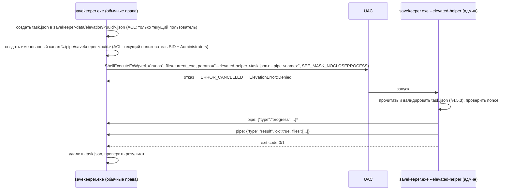

# SPEC-14: Дистрибуция, портативная сборка и повышение прав

| Поле | Значение |
|---|---|
| ID | SPEC-14 |
| Статус | approved |
| Фаза | P3 |
| Крейт(ы) | `app/src-tauri`, `sk-core::win::elevation`, `xtask` (dist), `.github/workflows/release.yml` |
| Зависит от | SPEC-00, SPEC-01, SPEC-06, SPEC-11, SPEC-12 |
| Используется в | SPEC-10 (экспорты с правами), SPEC-13 (драйверы) |
| Последнее изменение | 2026-10-01 (лицензия манифеста, лицензия проекта MIT) |

## 1. Цель

Поставлять SaveKeeper как **один портативный exe** (принцип P5): его можно запустить с
флешки на любой Windows 10 22H2+/11 без установки. Здесь описаны сборка, Windows-манифест
приложения, проверка WebView2, механизм точечного повышения прав для отдельных экспортов,
версионирование, релизный pipeline, лицензии третьих сторон, подпись кода и уведомления
об обновлениях.

## 2. Область

### 2.1 Входит
- Конфигурация Tauri для сборки без инсталлятора.
- Windows application manifest (`longPathAware`, `asInvoker`, DPI, `supportedOS`).
- Проверка WebView2 до создания окна.
- Elevation-хелпер: тот же exe в режиме `--elevated-helper`.
- Версионирование (semver + git hash), `app_info`.
- Релизы GitHub Actions: x86_64 и aarch64, zip с exe и лицензиями.
- Лицензии третьих сторон (`cargo-about`, npm), атрибуция манифеста Ludusavi.
- Подпись кода (опционально), SmartScreen.
- Размер exe, проверка обновлений (опционально, только уведомление).

### 2.2 Не входит
- MSI/NSIS-инсталлятор, автообновление с заменой exe, Microsoft Store, winget-пакет самого SaveKeeper (бэклог).
- CLI-дистрибуция: `savekeeper-cli.exe` кладётся в релизный zip как дополнительный файл, отдельной упаковки нет.

## 3. Требования

### 3.1 Функциональные
- **FR-14-01** — Релизный артефакт: `SaveKeeper-<version>-windows-<arch>.zip`, внутри `savekeeper.exe`, `savekeeper-cli.exe`, `LICENSE`, `THIRD_PARTY_LICENSES.html`, `README.txt`. Установка не требуется, при первом запуске рядом создаются конфиг и `savekeeper-data/` (SPEC-01 §4.8).
- **FR-14-02** — Exe запускается с `asInvoker` (без UAC при старте).
- **FR-14-03** — Если WebView2 Runtime не найден, до создания окна показывается нативный `MessageBoxW` (ru/en по языку ОС) с объяснением и ссылкой (текстом + кнопка «Открыть страницу загрузки» через `ShellExecuteW`) на Evergreen Bootstrapper: `https://go.microsoft.com/fwlink/p/?LinkId=2124703`. Также предлагается использовать `savekeeper-cli.exe`.
- **FR-14-04** — Операции, требующие прав администратора (экспорт драйверов SPEC-06, восстановление драйверов SPEC-13), выполняются **только** через elevation-хелпер (§4.5) по одной задаче на запрос UAC. Основной процесс остаётся непривилегированным.
- **FR-14-05** — Хелпер выполняет только задачи из закрытого whitelist (§4.5.3) с валидированными параметрами. Любая другая задача отклоняется.
- **FR-14-06** — Версия: `CARGO_PKG_VERSION` + короткий git hash + дата сборки, видна в «О программе», `--version` CLI, `manifest.json` (`app_version`, SPEC-10), логах, `VERSIONINFO`-ресурсе exe (свойства файла в Проводнике).
- **FR-14-07** — Проверка обновлений (опционально, **выключена** по умолчанию, `config.updates.check = false`): раз в 7 дней GET `https://api.github.com/repos/<owner>/savekeeper/releases/latest`, сравнение semver, баннер «Доступна версия X» со ссылкой. Без скачивания и замены exe.
- **FR-14-08** — В «О программе» и `THIRD_PARTY_LICENSES.html` указана атрибуция манифеста Ludusavi (mtkennerly/ludusavi-manifest, лицензия MIT; данные PCGamingWiki — CC BY-NC-SA 3.0, см. §9) и всех зависимостей.
- **FR-14-09** — Релизная сборка не содержит фич `e2e`, `replay`, devtools (проверка в release job).

### 3.2 Нефункциональные
- **NFR-14-01** — Размер `savekeeper.exe` ≤ 25 МБ (x86_64, с встроенным фронтом и правилами, без встроенного манифеста Ludusavi, §4.8).
- **NFR-14-02** — Холодный запуск с USB 2.0 флешки ≤ 4 с до окна.
- **NFR-14-03** — Воспроизводимость: сборка из тега в CI с `--locked`, фиксированный toolchain (`rust-toolchain.toml`), pnpm lockfile.
- **NFR-14-04** — Зависимость от VC++ Redistributable отсутствует: статическая CRT (`-C target-feature=+crt-static` для `*-windows-msvc`).

## 4. Дизайн

### 4.1 Конфигурация сборки Tauri

`app/src-tauri/tauri.conf.json` (фрагмент):
```jsonc
{
  "productName": "SaveKeeper",
  "identifier": "org.savekeeper.app",
  "version": "../../Cargo.toml",                       // единая версия workspace
  "build": { "frontendDist": "../dist", "beforeBuildCommand": "pnpm build" },
  "bundle": { "active": false },                        // без инсталлятора — используем target/release/savekeeper.exe
  "app": {
    "windows": [{ "title": "SaveKeeper", "width": 1200, "height": 780, "minWidth": 960, "minHeight": 600 }],
    "security": { "csp": "<см. SPEC-11 §4.8>" },
    "withGlobalTauri": false
  }
}
```
- Сборка: `cargo xtask dist --target x86_64-pc-windows-msvc` = `pnpm -C app build` → `cargo build -p savekeeper-app -p sk-cli --release --locked --target <t>` → упаковка zip (§4.7).
- Профиль release (`Cargo.toml`): `lto = "fat"`, `codegen-units = 1`, `opt-level = 3`, `strip = "symbols"`, `panic = "abort"` **не** используем (нужен `catch_unwind` для изоляции коллекторов, SPEC-01 §5).
- `.cargo/config.toml`: `[target.'cfg(all(windows, target_env = "msvc"))'] rustflags = ["-C", "target-feature=+crt-static"]`.
- WebView2 data folder (кэш WebView) по умолчанию лежит в `%LOCALAPPDATA%\org.savekeeper.app\EBWebView`. Для портативности переопределяется в `savekeeper-data/webview/` через `WebviewWindowBuilder::data_directory` (если папка exe записываема, иначе дефолт).

### 4.2 Windows application manifest

`app/src-tauri/windows/savekeeper.exe.manifest`, встраивается через `tauri-build` (`WindowsAttributes::app_manifest`) или `embed-resource`. Тот же манифест (без DPI-секции) используется для `savekeeper-cli.exe`.
```xml
<assembly xmlns="urn:schemas-microsoft-com:asm.v1" manifestVersion="1.0">
  <assemblyIdentity type="win32" name="SaveKeeper" version="0.1.0.0"/>
  <trustInfo xmlns="urn:schemas-microsoft-com:asm.v3">
    <security><requestedPrivileges><requestedExecutionLevel level="asInvoker" uiAccess="false"/></requestedPrivileges></security>
  </trustInfo>
  <compatibility xmlns="urn:schemas-microsoft-com:compatibility.v1">
    <application><supportedOS Id="{8e0f7a12-bfb3-4fe8-b9a5-48fd50a15a9a}"/></application> <!-- Windows 10/11 -->
  </compatibility>
  <application xmlns="urn:schemas-microsoft-com:asm.v3">
    <windowsSettings>
      <longPathAware xmlns="http://schemas.microsoft.com/SMI/2016/WindowsSettings">true</longPathAware>
      <dpiAwareness xmlns="http://schemas.microsoft.com/SMI/2016/WindowsSettings">PerMonitorV2</dpiAwareness>
      <activeCodePage xmlns="http://schemas.microsoft.com/SMI/2019/WindowsSettings">UTF-8</activeCodePage>
    </windowsSettings>
  </application>
  <dependency><dependentAssembly>
    <assemblyIdentity type="win32" name="Microsoft.Windows.Common-Controls" version="6.0.0.0" processorArchitecture="*" publicKeyToken="6595b64144ccf1df" language="*"/>
  </dependentAssembly></dependency>
</assembly>
```
- `longPathAware` работает, только если в системе включён `LongPathsEnabled`. Поэтому код всё равно использует `\\?\` (SPEC-02 §5). Манифест здесь — страховка для сторонних API.
- `VERSIONINFO` (FileVersion, ProductVersion, CompanyName, FileDescription, LegalCopyright) генерируется `tauri-build`/`winres` из версии workspace.

### 4.3 Проверка WebView2
- В `main()` до `tauri::Builder`: `webview2_com::Microsoft::Web::WebView2::Win32::GetAvailableCoreWebView2BrowserVersionString(None)`. Ошибка или пустая строка — WebView2 нет (FR-14-03).
- Дополнительно проверяется минимальная версия (≥ 110). Если старее, предупреждение в MessageBox с продолжением запуска.
- Аргументы командной строки обрабатываются **до** проверки WebView2: `--elevated-helper` (§4.5) и `--version` не требуют WebView.

### 4.4 Точка входа

```rust
// app/src-tauri/src/main.rs
fn main() -> ExitCode {
    let args = Args::parse_lenient();                 // не падает на неизвестных аргументах WebView2
    match args.mode {
        Mode::Version => { println!("{}", version::full()); ExitCode::SUCCESS }
        Mode::ElevatedHelper { task_file, pipe } => elevation::helper_main(task_file, pipe), // без окна
        Mode::Gui => {
            if let Err(e) = webview2::ensure_available() { webview2::show_missing_dialog(e); return ExitCode::from(1); }
            app::run()
        }
    }
}
```
В release `#![windows_subsystem = "windows"]` (нет консоли). Хелпер ничего не пишет в консоль, только в свой лог и в канал.

### 4.5 Elevation-хелпер

#### 4.5.1 Протокол


#### 4.5.2 Формат задачи
```jsonc
{
  "schema_version": 1,
  "nonce": "b64-32-bytes",                 // случайный, повторяется хелпером в первом сообщении канала
  "created_at": "2026-09-28T14:31:00Z",    // хелпер отклоняет задачи старше 120 с
  "parent_pid": 4312,                      // хелпер проверяет, что родитель жив и это тот же exe (путь образа совпадает)
  "task": "export_drivers",
  "params": { "out_dir": "E:\\Backups\\SaveKeeper-...partial\\system\\drivers" }
}
```

#### 4.5.3 Whitelist задач
| `task` | Параметры и валидация | Действие | Спека |
|---|---|---|---|
| `export_drivers` | `out_dir`: абсолютный путь, существует, это папка, внутри `.partial` целевого бэкапа или data-dir, без `..` | `pnputil /export-driver * "<out_dir>"` | SPEC-06 |
| `restore_drivers` | `dir`: абсолютный путь внутри открытого бэкапа или temp-распаковки data-dir, содержит `*.inf` | `pnputil /add-driver "<dir>\*.inf" /subdirs /install` | SPEC-13 |
| `export_system_info` *(резерв)* | — | зарезервировано для экспортов SPEC-06 с `requires_elevation`, добавляется правкой этой таблицы | SPEC-06 |

- Каждый новый тип задачи добавляется **только** правкой этой таблицы и `enum ElevatedTask`. Произвольных команд, строк командной строки и путей к exe из задачи нет.
- Команды запускаются с абсолютными путями `{WINDIR}\System32\pnputil.exe` (не через PATH), с `CREATE_NO_WINDOW`, в job object (убивается при закрытии канала/отмене).
- Отмена: основной процесс пишет в канал `{"type":"cancel"}` или закрывает канал. Хелпер завершает дочерний процесс и выходит с кодом 2.

```rust
// sk-core::win::elevation
pub enum ElevatedTask { ExportDrivers { out_dir: PathBuf }, RestoreDrivers { dir: PathBuf } }

#[async_trait]
pub trait ElevationBroker: Send + Sync {
    async fn run(&self, task: ElevatedTask, events: EventSink, cancel: CancellationToken) -> Result<ElevatedOutcome, ElevationError>;
}
pub enum ElevationError { Denied, HelperFailed { code: i32, message: String }, Timeout, Protocol(String), Unsupported }
pub struct ElevatedOutcome { pub stdout_tail: String, pub files: Vec<PathBuf> }

pub struct ShellRunasBroker { /* data_dir */ }       // реализация §4.5.1
pub struct AlreadyElevatedBroker;                     // если основной процесс уже с правами — выполняет задачу напрямую тем же кодом
```
- `sk-backup` (SPEC-10 T-10-09) и `sk-restore` (SPEC-13 T-13-07) получают `&dyn ElevationBroker`. В тестах — `MockBroker`.
- Если основной процесс уже запущен от администратора (`Environment.is_elevated`), используется `AlreadyElevatedBroker` без повторного UAC.

### 4.6 Версионирование
- SemVer в `[workspace.package] version` корневого `Cargo.toml`, единая для всех крейтов и `app/package.json` (синхронизирует `cargo xtask bump <version>`).
- `build.rs` в `sk-core` (или `app/src-tauri`) выставляет `SK_GIT_HASH` (`git rev-parse --short=8 HEAD`, `unknown` без git), `SK_BUILD_DATE`, `SK_DIRTY`.
- `version::full()` = `0.1.0+g1a2b3c4d` (+ `.dirty`) — формат для `app_version` (SPEC-10 §4.4).
- Теги: `v0.1.0`. Пререлизы: `v0.2.0-beta.1` (GitHub prerelease).
- `CHANGELOG.md` по Keep a Changelog. Раздел для версии обязателен перед тегом (проверка в release job).

### 4.7 Релизный pipeline

`.github/workflows/release.yml` (триггер: push тега `v*`):
```yaml
jobs:
  verify:        # windows-latest: полный ci.yml (reusable workflow) + проверка CHANGELOG + версия тега == версия Cargo.toml
  build:
    needs: verify
    strategy: { matrix: { target: [x86_64-pc-windows-msvc, aarch64-pc-windows-msvc] } }
    runs-on: windows-latest
    steps:
      - rustup target add ${{ matrix.target }}
      - pnpm -C app install --frozen-lockfile
      - cargo xtask dist --target ${{ matrix.target }}   # сборка + проверка отсутствия фич e2e/replay (cargo tree -e features)
      - cargo about generate about.hbs > dist/THIRD_PARTY_LICENSES.html   # Rust-зависимости + npm (license-checker → вставка)
      - (опц.) подпись exe (§4.9)
      - сжать в SaveKeeper-${{ version }}-windows-${{ arch }}.zip, посчитать SHA256
      - smoke: запустить savekeeper-cli.exe --version и savekeeper-cli.exe env (только x86_64)
      - upload-artifact
  publish:
    needs: build
    steps: [download-artifacts, "gh release create $TAG --draft --notes-file <секция CHANGELOG> *.zip SHA256SUMS.txt"]
```
- Релиз создаётся как **draft**. Публикация вручную после ручного smoke на VM (чек-лист SPEC-12 §4.10, пп. 2 и 5).
- aarch64 собирается кросс-компиляцией на x86_64-раннере. Smoke только на x86_64, для ARM — ручная проверка при наличии устройства.
- `SHA256SUMS.txt` публикуется рядом, хэши дублируются в описании релиза.

### 4.8 Размер exe и встроенные ресурсы
- Встраиваются: фронтенд (Tauri assets), `rules/` (SPEC-04, `include_dir!`), шаблоны отчёта (SPEC-10), i18n.
- **Не** встраивается: полный манифест Ludusavi (~20+ МБ YAML). Он скачивается при первом запуске в кэш (SPEC-05). Для офлайн-запуска в релизный zip **опционально** кладётся `savekeeper-data/cache/ludusavi-manifest.yaml` на дату сборки (решение SPEC-05; здесь — только механизм: `xtask dist --bundle-manifest`).
- Контроль размера: release job падает, если `savekeeper.exe` > 25 МБ (NFR-14-01), и печатает `cargo bloat --release --crates -n 20`.

### 4.9 Подпись кода и SmartScreen
- Без подписи SmartScreen показывает «Windows защитила ваш компьютер» для новых exe. Это ожидаемо для MVP. `README.txt` и страница релиза объясняют: «Подробнее → Выполнить в любом случае», и дают SHA256 для проверки.
- Варианты подписи (решение в §9): SignPath Foundation (бесплатно для OSS, подпись в CI), Azure Trusted Signing (платно, ~$10/мес, мгновенная репутация для организаций), классический OV-сертификат.
- Подпись встраивается шагом release job после сборки и **до** упаковки в zip. Подписываются оба exe.
- Антивирусные ложные срабатывания (портативный exe + `reg export`/`netsh` + UAC-хелпер): перед релизом прогнать артефакт через VirusTotal (вручную), при ложных срабатываниях отправить в Microsoft Defender WDSI.

### 4.10 Проверка обновлений (опционально)
- Реализована в `app/src-tauri` (`reqwest` + `rustls`, таймаут 5 с), единственный сетевой вызов вне `sk-llm`/`sk-games` (разрешено в SPEC-12 §4.6).
- Результат кэшируется в `savekeeper-data/cache/update-check.json` (`checked_at`, `latest`).
- Настройка в UI: «Проверять обновления» (выкл по умолчанию), кнопка «Проверить сейчас».
- В запросе нет никаких данных пользователя, кроме стандартного `User-Agent: SaveKeeper/<version>`.

## 5. Ошибки и граничные случаи

| Ситуация | Поведение |
|---|---|
| Нет WebView2 | FR-14-03, код выхода 1. CLI работает. |
| Запуск из zip без распаковки (Проводник открывает exe во временной папке) | Детект: путь exe внутри `%TEMP%\...\Temp1_*.zip` или папка не записываема → баннер «Распакуйте архив, иначе настройки не сохранятся», data-dir fallback (SPEC-01 FR-01-05). |
| Запуск с сетевого диска или UNC | Работает, data-dir рядом, если есть права записи. Предупреждение о скорости. |
| UAC отклонён | `ElevationError::Denied` → экспорт `elevation_denied` (SPEC-10), бэкап продолжается. |
| UAC отключён политикой, пользователь не админ | `ShellExecuteExW` вернёт ошибку → `Unsupported`, в UI: «Требуются права администратора, попросите администратора или пропустите». |
| Хелпер получил просроченную, чужую или невалидную задачу | Отказ, код 3, запись в лог хелпера `savekeeper-data/logs/elevated-*.log`. |
| Родительский процесс завершился во время работы хелпера | Хелпер детектирует разрыв канала → завершает дочерний процесс → выход. |
| Антивирус удалил или заблокировал exe | Вне контроля. README и FAQ описывают ситуацию, SHA256 для проверки. |
| ARM64-устройство с x64-сборкой | Работает через эмуляцию. Рекомендация — aarch64-сборка. |

## 6. Тестирование

- **Unit:** валидация задач хелпера (пути вне разрешённых корней, `..`, относительные, просроченный `created_at`, неверный nonce, неизвестный `task`); парсинг аргументов (`--elevated-helper` с лишними аргументами WebView2); `version::full()`.
- **Windows-интеграционные:**
  - протокол канала: хелпер, запущенный **без** runas (тестовый режим `SK_ELEVATION_TEST=1` разрешает запуск без прав только для задачи-пустышки `noop`, собираемой под `cfg(test)`), обмен progress/result/cancel;
  - `ensure_available()` на раннере (WebView2 есть) → Ok;
  - манифест встроен: `mt.exe -inputresource:savekeeper.exe;#1 -out:m.xml` содержит `longPathAware` и `asInvoker` (шаг release job).
- **Manual (`#[ignore = "manual"]`, чек-лист релиза):** UAC-запрос и отказ; экспорт драйверов на VM; запуск на чистой Windows 10 22H2 без WebView2 (VM с удалённым Runtime) → диалог; запуск с FAT32-флешки; SmartScreen-поведение неподписанного exe.
- **Release job:** проверка размера, отсутствия фич `e2e`/`replay`, наличия `THIRD_PARTY_LICENSES.html`, `--version` совпадает с тегом.

## 7. Задачи

- [ ] **T-14-01** — Конфиг Tauri §4.1 (`bundle.active=false`, версия из workspace, WebView data dir в `savekeeper-data/webview`), release-профиль, `crt-static`. *Зависит:* T-11-01.
- [ ] **T-14-02** — Windows manifest + VERSIONINFO для обоих exe. *Зависит:* T-14-01. *Готово, когда:* проверка `mt.exe` в CI.
- [ ] **T-14-03** — Точка входа `main.rs` (режимы, `windows_subsystem`), проверка WebView2 + нативный диалог ru/en. *Зависит:* T-14-01.
- [ ] **T-14-04** — Версионирование: `build.rs` (git hash, дата), `version::full()`, `xtask bump`, `app_info`. *Зависит:* T-12-01.
- [ ] **T-14-05** — Elevation: `ElevatedTask`, `ElevationBroker`, `ShellRunasBroker`, `AlreadyElevatedBroker`, `MockBroker`, `helper_main`, канал с ACL, nonce, job object, отмена. *Зависит:* T-02-05. *Готово, когда:* unit-тесты валидации и Windows-тест протокола с `noop`.
- [ ] **T-14-06** — Детект запуска из zip/только-для-чтения папки + баннер (совместно с SPEC-01 FR-01-05). *Зависит:* T-01-04, T-11-05.
- [ ] **T-14-07** — `cargo xtask dist` (сборка, проверка фич, размер, упаковка zip, `--bundle-manifest`). *Зависит:* T-14-01..04.
- [ ] **T-14-08** — `THIRD_PARTY_LICENSES.html`: `cargo-about` (`about.toml`, `about.hbs`) + npm-лицензии + атрибуция Ludusavi/PCGamingWiki; экран «О программе». *Зависит:* T-14-07.
- [ ] **T-14-09** — `release.yml` (verify → build matrix → draft release, SHA256SUMS). *Зависит:* T-14-07, T-14-08, T-12-02.
- [ ] **T-14-10** — (опц.) проверка обновлений §4.10 + настройка в UI. *Зависит:* T-11-09.
- [ ] **T-14-11** — (опц.) подпись кода в CI после решения §9. *Зависит:* T-14-09.
- [ ] **T-14-12** — `README.txt` для релиза (ru/en: запуск, SmartScreen, WebView2, где лежат данные, SHA256). *Зависит:* —.

## 8. Критерии приёмки

- [ ] Тег `v0.1.0` → draft-релиз с двумя zip и `SHA256SUMS.txt` без ручных шагов.
- [ ] Распакованный `savekeeper.exe` запускается без UAC на чистых Windows 10 22H2 и Windows 11 (VM), создаёт `savekeeper.config.json` и `savekeeper-data/` рядом и ничего не пишет в `%LOCALAPPDATA%` (кроме случая с незаписываемой папкой).
- [ ] Без WebView2 показывается понятный диалог. Процесс не падает с непонятной ошибкой.
- [ ] Экспорт драйверов запрашивает UAC ровно один раз. Отказ не ломает бэкап.
- [ ] Хелпер отклоняет задачу вне whitelist (тест) и задачу с путём вне разрешённых корней.
- [ ] `savekeeper.exe` ≤ 25 МБ.

## 9. Открытые вопросы

- Подпись кода: SignPath Foundation (требует публичного OSS-репозитория и одобрения) или Azure Trusted Signing? Решение до v0.1.0 или осознанно выпускать неподписанный MVP.
- ~~Лицензирование манифеста Ludusavi~~ **Решено (2026-10-01):** проект некоммерческий, снапшот встраивается (SPEC-05 FR-05-11). Релизный job проверяет, что `THIRD_PARTY_LICENSES.html` содержит блок атрибуции PCGamingWiki/Ludusavi.
- ~~Лицензия самого SaveKeeper~~ **Решено (2026-10-01):** MIT. Файл `LICENSE` в корне репозитория и в релизном zip. Allow-лист `deny.toml` (SPEC-12 T-12-04) с MIT совместим. Для SignPath Foundation (бесплатная подпись open-source) MIT подходит.
- Предложение к SPEC-01 §4.8.2: добавить `updates: { check: false, interval_days: 7 }` в схему конфига.
- Предложение к SPEC-01 §4.2 / SPEC-02: модуль `sk-core::win::elevation` (трейт `ElevationBroker` и `ElevatedTask`) размещается в `sk-core`, чтобы `sk-backup` и `sk-restore` не зависели от `app/`. Реализация `ShellRunasBroker` там же (`cfg(windows)`).
- Предложение к SPEC-06: у экспортёров с `requires_elevation` описать, какую `ElevatedTask` они используют (сейчас только драйверы).
